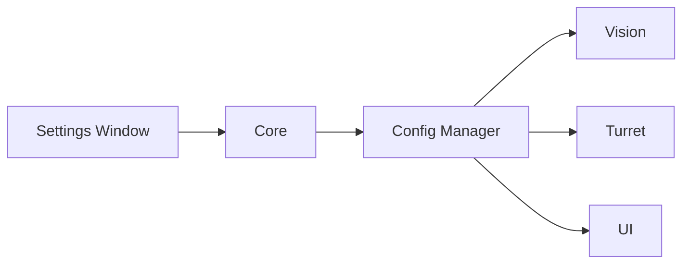

# Конфигурация системы

Этот документ описывает структуру конфигурации приложения и назначение основных параметров.

`Config Manager` является частью Core. Он загружает настройки из `config.json`, хранит их в памяти, сохраняет изменения и передаёт обновления заинтересованным модулям.

## Общие правила

- Конфигурация хранится в `config.json`.
- При запуске приложения `Config Manager` загружает файл в память.
- Изменения из UI сначала поступают в Core, затем в `Config Manager`.
- Рабочие модули не должны напрямую изменять общий файл конфигурации.
- Каждый модуль получает только относящиеся к нему параметры.
- Настройки, изменяемые пользователем и сохраняемые между запусками, должны находиться в конфигурации.
- Какие параметры можно применять сразу, а какие требуют переинициализации компонента, будет определено отдельно.

## Структура верхнего уровня

```text
config
├── vision
├── turret
├── ui
└── supervisor
```

# vision

Раздел `vision` содержит настройки трёх фиксированных camera pipeline и общего компонента определения дальности.

В системе используются три постоянные роли камер:

- `overview`;
- `stereo-left`;
- `stereo-right`.

Роли камер не меняются во время работы приложения.

## vision.cameras

```text
vision
└── cameras
    ├── overview
    ├── stereo-left
    └── stereo-right
```

Каждая камера имеет собственный pipeline:

```text
получение кадра
→ Detector
→ Tracker
→ VisionResult
```

Detector и Tracker могут быть включены или отключены отдельно для каждой камеры.

## Общие параметры камеры

Для каждой камеры используются следующие настройки.

### enabled

```text
enabled: bool
```

Включает или отключает camera pipeline целиком.

### address

```text
address: str
```

IP-адрес Raspberry Pi, с которого приходит видеопоток.

### port

```text
port: int
```

UDP-порт видеопотока.

### rtp-enabled

```text
rtp-enabled: bool
```

Использовать ли RTP для видеопотока.

### buffer-size

```text
buffer-size: int
```

Размер буфера видеопотока.

Точное значение подбирается экспериментально с учётом требования не накапливать задержку.

### detection-enabled

```text
detection-enabled: bool
```

Включает Detector для этой камеры.

### tracking-enabled

```text
tracking-enabled: bool
```

Включает Tracker для этой камеры.

### detector-class

```text
detector-class: str
```

Имя используемой реализации Detector.

### tracker-class

```text
tracker-class: str
```

Имя используемой реализации Tracker.

## overview

`overview` — обзорная камера.

Она используется:

- для отображения в основном интерфейсе;
- для Detector;
- для Tracker;
- для отдельного пользовательского выбора цели.

## stereo-left

`stereo-left` — левая камера стереопары.

Она используется:

- для отображения в основном интерфейсе;
- для Detector;
- для Tracker;
- для отдельного пользовательского выбора цели;
- для запуска `Stereo / Distance Provider`.

`Stereo / Distance Provider` выполняется в потоке `stereo-left`.

## stereo-right

`stereo-right` — правая камера стереопары.

Она используется прежде всего для определения дальности.

В обычном интерфейсе камера не отображается.

Её изображение может включаться отдельно в диагностическом режиме.

Detector и Tracker для `stereo-right` могут быть отключены, если они не нужны для текущей реализации.

## vision.distance

Раздел содержит настройки определения дальности.

```text
vision
└── distance
    ├── source
    ├── manual-distance
    └── stereo
```

### source

```text
source: str
```

Выбирает текущий источник дальности.

Поддерживаемые значения на первом этапе:

```text
stereo
manual
```

В будущем могут быть добавлены другие источники, например лидар.

### manual-distance

```text
manual-distance: float
```

Постоянная дальность, задаваемая пользователем при:

```text
source = "manual"
```

Единица измерения должна быть окончательно определена вместе с контрактом `DistanceResult`.

## vision.distance.stereo

Настройки стереоопределения дальности.

Левая и правая камеры аппаратно синхронизированы.

Для сопоставления кадров используется `capture-id`.

`receive-timestamp` используется отдельно для:

- диагностики;
- измерения задержки;
- определения устаревшего видеопотока.

### right-frame-buffer-size

```text
right-frame-buffer-size: int
```

Максимальное количество правых кадров, временно хранящихся для поиска кадра с соответствующим `capture-id`.

Буфер должен быть небольшим и ограниченным.

Он не используется как очередь последовательной обработки старых кадров.

### pair-timeout-ms

```text
pair-timeout-ms: int
```

Максимальное время ожидания соответствующего кадра второй камеры.

Точное значение будет определено после измерения реальной задержки между двумя Raspberry Pi.

### stereo-enabled

```text
stereo-enabled: bool
```

Разрешает работу Stereo при выбранном источнике дальности `stereo`.

## vision.camera-stale-timeout

```text
camera-stale-timeout: float
```

Время без нового кадра, после которого видеопоток считается устаревшим.

Для определения используется `receive-timestamp`.

Точное значение подбирается экспериментально.

## vision.simulation-mode

```text
simulation-mode: bool
```

Включает режим работы Vision без реальных камер.

Источник кадров в этом режиме может быть заменён на:

- видеофайл;
- набор изображений;
- виртуальную камеру;
- другой тестовый источник.

## Параметры Detector и Tracker

Окончательная схема хранения внутренних параметров конкретных Detector и Tracker пока не утверждена.

Остаётся решить:

- какие параметры являются внутренними константами реализации;
- какие параметры должен менять пользователь;
- какие параметры должны сохраняться между запусками;
- как передавать изменения в работающий camera pipeline.

До принятия этого решения в конфигурации фиксируются только:

```text
detector-class
tracker-class
detection-enabled
tracking-enabled
```

# turret

Раздел `turret` содержит настройки Turret Controller и Turret HAL.

```text
turret
├── serial
├── controller
├── backlash
└── emulate-stm32
```

## turret.serial

Настройки последовательного интерфейса STM32.

### port

```text
port: str
```

Имя последовательного порта.

### baudrate

```text
baudrate: int
```

Скорость UART.

### timeout-ms

```text
timeout-ms: int
```

Максимальное время ожидания ответа STM32.

Точное поведение timeout зависит от будущего Serial Protocol.

### retry-count

```text
retry-count: int
```

Максимальное количество повторных попыток передачи.

Точная политика retry будет определена вместе с Serial Protocol.

### uart-min-command-interval-ms

```text
uart-min-command-interval-ms: int
```

Минимальный интервал между последовательными командами, которые Turret HAL отправляет в STM32.

Этот параметр нужен для защиты UART и STM32 от слишком частой отправки пакетов.

Точное значение подбирается по:

- `baudrate`;
- размеру UART-пакета;
- времени обработки команды STM32;
- результатам тестов на реальном оборудовании.

На этапе прототипа HAL не должен отправлять следующую обычную команду раньше этого интервала.

## turret.controller

Настройки высокоуровневого управления Turret.

### pid-kp-x

```text
pid-kp-x: float
```

Пропорциональный коэффициент PI-регулятора по оси X.

### pid-ki-x

```text
pid-ki-x: float
```

Интегральный коэффициент PI-регулятора по оси X.

### pid-kp-y

```text
pid-kp-y: float
```

Пропорциональный коэффициент PI-регулятора по оси Y.

### pid-ki-y

```text
pid-ki-y: float
```

Интегральный коэффициент PI-регулятора по оси Y.

## turret.backlash

Компенсация механического люфта.

### x

```text
x: float
```

Компенсация люфта по оси X.

### y

```text
y: float
```

Компенсация люфта по оси Y.

## turret.emulate-stm32

```text
emulate-stm32: bool
```

Включает эмуляцию STM32 вместо физического контроллера.

# ui

Раздел `ui` содержит только настройки пользовательского интерфейса.

## ui.default-camera

```text
default-camera: str
```

Камера, которая выбирается основной при запуске UI.

Допустимые значения:

```text
overview
stereo-left
```

`stereo-right` не используется как основная камера обычного интерфейса.

## ui.show-fps

```text
show-fps: bool
```

Показывать ли FPS в интерфейсе.

## ui.show-stereo-right-diagnostics

```text
show-stereo-right-diagnostics: bool
```

Разрешает отображение `stereo-right` в диагностическом режиме.

Точное место отображения правой камеры в UI пока не определено.

# supervisor

Настройки контроля состояния рабочих компонентов.

## supervisor.enabled

```text
enabled: bool
```

Включает Supervisor.

## supervisor.heartbeat-timeout

```text
heartbeat-timeout: float
```

Максимальное допустимое время без обновления состояния контролируемого компонента.

Какие именно компоненты Supervisor будет контролировать окончательно, пока не утверждено.

# Пример config.json

Ниже приведён пример структуры конфигурационного файла.

Значения являются демонстрационными и не считаются рекомендуемыми рабочими параметрами.

```json
{
  "vision": {
    "cameras": {
      "overview": {
        "enabled": true,
        "address": "192.168.1.101",
        "port": 5001,
        "rtp-enabled": false,
        "buffer-size": 1,
        "detection-enabled": true,
        "tracking-enabled": true,
        "detector-class": "ROIBasedDetector",
        "tracker-class": "KalmanTracker"
      },
      "stereo-left": {
        "enabled": true,
        "address": "192.168.1.102",
        "port": 5002,
        "rtp-enabled": false,
        "buffer-size": 1,
        "detection-enabled": true,
        "tracking-enabled": true,
        "detector-class": "ROIBasedDetector",
        "tracker-class": "KalmanTracker"
      },
      "stereo-right": {
        "enabled": true,
        "address": "192.168.1.103",
        "port": 5003,
        "rtp-enabled": false,
        "buffer-size": 1,
        "detection-enabled": false,
        "tracking-enabled": false,
        "detector-class": "ROIBasedDetector",
        "tracker-class": "KalmanTracker"
      }
    },
    "distance": {
      "source": "manual",
      "manual-distance": 100.0,
      "stereo": {
        "stereo-enabled": true,
        "right-frame-buffer-size": 4,
        "pair-timeout-ms": 100
      }
    },
    "camera-stale-timeout": 0.5,
    "simulation-mode": false
  },
  "turret": {
    "serial": {
      "port": "/dev/ttyUSB0",
      "baudrate": 115200,
      "timeout-ms": 100,
      "retry-count": 3,
      "uart-min-command-interval-ms": 10
    },
    "controller": {
      "pid-kp-x": 1.0,
      "pid-ki-x": 0.0,
      "pid-kp-y": 1.0,
      "pid-ki-y": 0.0
    },
    "backlash": {
      "x": 0.0,
      "y": 0.0
    },
    "emulate-stm32": false
  },
  "ui": {
    "default-camera": "overview",
    "show-fps": true,
    "show-stereo-right-diagnostics": false
  },
  "supervisor": {
    "enabled": true,
    "heartbeat-timeout": 5.0
  }
}
```

# Применение изменений

Общий путь изменения настройки:



Конкретный модуль получает только относящиеся к нему изменения.

Безопасный механизм применения изменений между потоками пока не утверждён.

Также пока не определено, какие параметры относятся к:

- динамическим;
- требующим локальной переинициализации;
- доступным только при запуске.

Эти вопросы перечислены в:

[Открытые вопросы архитектуры](./problems.md)
