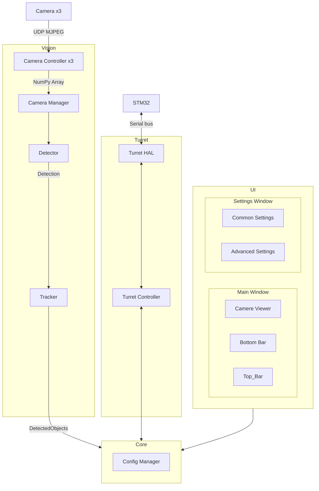

# Общая схема системы

Здесь представлена общая схема системы и почему были применены те или иные
протоколы, подходы. Подробное описание каждого узла смотреть в соответствующих документах

## Что нужно решить/уточнитить

[Проблемы и решения](./problems.md)

## Схема

## Core

Ядро системы — это «диспетчерская», которая управляет взаимодействием всех частей программы. Оно не выполняет тяжёлые вычисления, а только координирует их работу и передаёт данные между модулями через очереди сообщений.

### Как работает Core (паттерн Медиатор)

Представьте, что у вас есть несколько отделов (модулей), и им нужно обмениваться информацией. Вместо того чтобы каждый отдел звонил напрямую друг другу (что создаёт хаос), вы ставите секретаря (Core). Все отделы сообщают секретарю, что им нужно, а секретарь перенаправляет эту информацию тому, кому она адресована. Это и есть **паттерн Медиатор** – центральный узел, который упрощает связи между компонентами.

В нашей системе это реализовано через **очереди сообщений**. Каждый модуль работает независимо и общается с другими только через Core, кладя сообщения в очереди и забирая их оттуда.

### Очереди сообщений

Core содержит следующие потокобезопасные очереди (производитель → потребитель):

- `frame_queue` – от потока захвата к потоку обработки (кадры NumPy Array)
- `object_queue` – от потока обработки к потоку управления турелью (`DetectedObject`)
- `command_queue` – от UI (или Core) к потоку управления турелью (команды)
- `status_queue` – от потока управления турелью к UI (состояние)
- `ui_command_queue` – от UI к Core (изменение настроек) – может быть объединена с `command_queue`, но для ясности разделим.
- `ui_status_queue` – от Core к UI (обновления состояния для отображения) – может быть объединена с `status_queue`.

Core не обрабатывает содержимое сообщений, а только предоставляет механизм их передачи. Это обеспечивает слабую связанность – замена детектора не затрагивает турель или UI.

### Потоки (упрощённая модель)

Для эффективной работы используется **3 дополнительных потока** (плюс главный поток UI):

1. **Поток захвата видео** – непрерывно получает кадры с камер и помещает их в `frame_queue`.
2. **Поток обработки (Vision Pipeline)** – забирает кадры из очереди, последовательно выполняет детекцию и трекинг, затем кладёт результат (`DetectedObject`) в `object_queue`.
3. **Поток управления турелью** – слушает `command_queue` (и возможно `status_queue`), отправляет команды на STM32 и периодически публикует текущее состояние в `status_queue`.
4. **Главный поток (UI)** – отвечает за интерфейс, читает `ui_status_queue` для обновления информации и отправляет команды пользователя через `ui_command_queue`.

Все очереди потокобезопасны (используется `queue.Queue`), поэтому синхронизация не требуется.

### Config Manager

- Хранит все настройки в едином словаре (в памяти).
- Поддерживает загрузку/сохранение из файла (JSON) при старте и по запросу.
- Оповещает подписанные модули об изменениях настроек через callback или через отдельную очередь (на начальном этапе можно использовать callback, чтобы не плодить очереди). 
- Любой модуль может подписаться на обновления нужных разделов конфигурации.

### Супервизор (опционально)

Core может отслеживать состояние потоков (например, через таймауты). При зависании или ошибке – перезапускать проблемный поток. Реализуется на втором этапе разработки.

## Vision

Модуль Vision отвечает за получение видеопотока с трёх камер, обнаружение объектов и их сопровождение. Он состоит из модуля получения кадров (`Camera Manager`), детектора и трекера, которые работают последовательно в одном потоке обработки.

### Камеры (Camera x3)

- Три Raspberry Pi, каждая с камерой, подключены по Ethernet в общую локальную сеть.
- **Две камеры** (стереопара) имеют малый угол обзора и используются для стереозрения и прицеливания.
- **Третья камера** имеет большой угол обзора и используется для общего наблюдения.

### Camera Controller (x3)

Каждый контроллер – это отдельный воркер, который подключается к своей камере, получает видеопоток и преобразует его в удобный формат.

- Передача изображений осуществляется в формате **MJPEG** по **UDP** с помощью **Gstreamer Raw UDP**.
- **RTP** (временные метки) опционально включается параметром в настройках. По умолчанию RTP выключен, чтобы минимизировать задержку. При возникновении артефактов видеопотока (рассинхрон кадров) пользователь может включить RTP – это добавит ~70 мс задержки, но повысит стабильность.
- На выходе контроллер отдаёт кадр в виде **NumPy Array** (формат, совместимый с OpenCV и PyQt).
- При обрыве соединения контроллер автоматически пытается переподключиться до восстановления связи.
- Реализация использует Python-библиотеки (OpenCV, Gstreamer bindings); отдельный бинарник ffmpeg не применяется.

### Camera Manager

Модуль получения кадров управляет тремя контроллерами:

- Назначает IP-адреса и порты для подключения к каждой камере (конфигурируется через настройки).
- Предоставляет доступ к кадрам: хранит **последний полученный кадр** для каждой камеры (перезаписывается при поступлении нового). Это обеспечивает актуальность данных без накопления очереди.
- При необходимости может предоставлять **синхронизированную пару кадров** с двух стереокамер, если в настройках включено стереозрение. Если стереозрение отключено, синхронизация не выполняется, и каждая камера работает независимо.

### Detector

Детектор отвечает за обнаружение объектов **в текущем кадре (моментально, без учёта времени)**. Он является абстрактным классом, что позволяет подключать разные алгоритмы. В системе предусмотрено два основных подхода (выбор через конфигурацию):

#### Подход 1. Скользящее окно с разбиением на клетки

- Окно фиксированного размера (например, 64×64 или 128×128 пикселей) перемещается по изображению с заданным шагом (например, 8 или 16 пикселей).
- Внутри каждого окна оно разбивается на клетки (например, 16×16 пикселей). Для каждой клетки вычисляются признаки (гистограммы градиентов, яркость, текстура и т.п.) – список признаков описан ниже.
- Все признаки из всех клеток объединяются в длинный вектор, который подаётся на вход полносвязной нейросети-классификатора (~50–100 нейронов).
- Если нейросеть выдаёт положительный ответ, координаты окна становятся рамкой `Detection`.
- **Применимость:** хорошо работает для объектов, размер которых сопоставим с размером окна. Для маленьких объектов требует использования пирамиды масштабов или уменьшения размера клетки.

#### Подход 2. Поиск областей интереса (ROI) с последующей проверкой

- Сначала применяется быстрый алгоритм выделения **областей-кандидатов** (ROI), которые потенциально содержат объекты. Для поиска контрастных объектов используется выделение градиентов (например, оператор Canny), пороговая обработка или метод вычисления дисперсии яркости.
- Полученные ROI – это прямоугольники, внутри которых вероятно наличие объекта.
- Для каждого ROI запускается нейросеть на векторе признаков (аналогично первому подходу, но только внутри ROI) для подтверждения и уточнения рамки.
- **Применимость:** более эффективен для поиска контрастных объектов любого размера, включая очень маленькие (меньше клетки), так как этап выделения ROI работает на уровне пикселей и не зависит от размера клетки.

**Рекомендация:** по умолчанию используется **второй подход**, так как он лучше соответствует задаче поиска контрастных объектов и экономит вычислительные ресурсы.

#### Признаки для нейросети

Для каждого кандидата (рамки или ROI) вычисляется вектор из **45 числовых признаков**. Признаки делятся на группы:

| Группа | Признаки | Размерность | Вычисление (OpenCV) |
|--------|----------|-------------|----------------------|
| Геометрические | ширина, высота, площадь, соотношение сторон, координаты центра (x,y) нормализованные | 5 | `cv2.boundingRect`, нормализация на размер кадра |
| Яркостные | средняя яркость, дисперсия, минимум, максимум, размах | 4 | `cv2.meanStdDev`, `cv2.minMaxLoc` |
| Контрастные | среднеквадратичный контраст, контраст по Веберу | 2 | формулы на основе статистики яркости |
| Гистограммные | 8-биновая гистограмма яркости (нормированная) | 8 | `cv2.calcHist` с 8 бинами |
| Цветовые (если камера цветная) | средние B,G,R и дисперсии, гистограммы по 4 бинам на канал | 12 | `cv2.meanStdDev`, `cv2.calcHist` (3 канала × 4 бина) |
| Текстурные (GLCM) | энергия, энтропия, контраст, корреляция | 4 | `skimage.feature.graycomatrix` и `graycoprops` (или ручная реализация) |
| Градиентные | 8-биновая гистограмма ориентаций градиентов (без блоков) + средняя магнитуда | 8 | `cv2.Sobel`, вычисление углов и магнитуд, гистограмма |
| Пространственные | положение рамки относительно центра кадра, расстояние до центра | 2 | нормализованные координаты |

**Итого:** 5+4+2+8+12+4+8+2 = **45 признаков**.

Вычисление признаков выполняется в методе `extract_features(roi)` внутри конкретного детектора. Вектор признаков сохраняется в дата-классе `Detection` как поле `features: np.ndarray` (тип float32).

Детектор выдаёт список `Detection` для каждого обнаруженного объекта. Каждый `Detection` содержит:
- координаты ограничивающей рамки (x, y, w, h),
- набор признаков (`features`),
- уверенность (confidence score) – опционально.

Важно: `Detection` не идентифицирует объект во времени – это просто «наблюдение» на данном кадре.

### Tracker

Трекер принимает список `Detection` с нескольких последовательных кадров и привязывает их к **конкретным объектам** (выполняет ассоциацию во времени). Является абстрактным классом, что позволяет использовать разные алгоритмы (например, венгерский алгоритм, фильтр Калмана, SORT).

Результат работы трекера – список `DetectedObject`, где каждый объект имеет:
- уникальный идентификатор (номер),
- текущие координаты рамки,
- предысторию (последние положения) – опционально,
- скорость и траекторию (вычисляется на основе изменений координат),
- опциональное поле `features` (вектор признаков из последнего `Detection`) – может быть `None`; на начальном этапе не используется для ассоциации, но оставлено для будущих улучшений.

### Стереозрение

Стереозрение выполняется **после трекинга** – для каждого объекта из `DetectedObject` (имеющего ID) вычисляется глубина по его текущей рамке, используя синхронизированные кадры с двух стереокамер (левой и правой). Это позволяет:
- Снизить вычислительную нагрузку (глубина считается только для выбранных объектов, а не для всего кадра).
- Упростить архитектуру (не нужно тащить глубину через трекер).

Порядок работы со стереопарой:
1. Получаем кадры с левой и правой камеры (синхронизированные по времени). Синхронизация включается параметром в настройках.
2. Запускаем детектор и трекер на левом кадре (или правом – настраивается) – получаем объекты с рамками.
3. Для каждого объекта, для которого нужна глубина (например, для текущей цели), выполняем стереосопоставление (блоковое сопоставление или полуглобальный алгоритм) внутри его рамки.
4. Вычисляем расстояние до объекта и добавляем его в `DetectedObject`.

Если стереозрение отключено, то расстояние для наведения вводится пользователем вручную через UI (например, в поле ввода) и передаётся в Core для турели.

### Поток обработки (Vision Pipeline)

Детектор и трекер работают **последовательно в одном потоке** (поток обработки):
1. Захватчик (`Camera Manager`) помещает кадры в `frame_queue`. Если стереозрение включено, в очередь помещается пара синхронизированных кадров (левый и правый).
2. Поток обработки забирает кадр (или пару кадров) из очереди.
3. Передаёт кадр в детектор, получает список `Detection`.
4. Передаёт список `Detection` в трекер, получает список `DetectedObject` (с обновлёнными идентификаторами и историей).
5. **Если стереозрение включено** – для каждого объекта из `DetectedObject` вычисляется глубина по его рамке, используя второй кадр из пары, и добавляется в объект.
6. Кладет `DetectedObject` в `object_queue` для дальнейшего использования турелью и UI.

Такая последовательная схема упрощает синхронизацию и отладку. При необходимости частоту обработки можно регулировать (например, обрабатывать каждый второй кадр), чтобы не перегружать систему.

### Конфигурация

Конфигурация модуля Vision хранится в `Config Manager` и делится на две части: **глобальные настройки** (для всего модуля) и **настройки для каждой камеры**.

#### Глобальные настройки (для всего Vision)
- `stereo_enabled: bool` – включено ли стереозрение для стереопары (двух камер с малым углом обзора). Если выключено, синхронизация кадров не производится, и расстояние для наведения задаётся пользователем вручную через UI.

#### Настройки для каждой камеры (индивидуальные)
Для каждой из трёх камер (две стерео + одна обзорная) можно независимо задать:
- `enabled: bool` – включена ли обработка видеопотока (детекция + трекинг). Если выключено, кадры передаются только на отображение в UI без анализа.
- `detector_class: str` – имя класса детектора (например, `"SlidingWindowDetector"` или `"ROIBasedDetector"`).
- `tracker_class: str` – имя класса трекера (например, `"KalmanTracker"` или `"HungarianTracker"`).

**Важно:** параметры алгоритмов (размер окна, шаг, пороги, коэффициенты фильтра и т.п.) **не хранятся в Config Manager**. Каждый конкретный детектор и трекер имеет собственный внутренний словарь параметров, который передаётся в его конструктор при создании экземпляра. Это позволяет гибко настраивать каждый алгоритм независимо, не загромождая общий конфиг.

## Turret

- `Turret HAL` - низкоуровневое общение с STM32 по последовательной шине для управления шаговыми двигателями и спуском

    Шина не поддерживает передачу сообщений в обе стороны одновременно, только в одну. Вынужденная мера для защиты от помех
    при передаче данных по длинному проводу

- `Turret Controller`  - Высокоуровневое API для ядра и выполнение вспомогательных операций

    К вспомогательным операциям относятся:
    - запуск калибровок
    - компенсация люфта
    - PI-регулятор для наведения на цель
    - и т.д.

## UI

Написан на PyQt6

- `Main Window` - Главное окно, первое что видит пользователь при запуске

    Содержит:
    - виджет для отображения видеопотока и рамок, обработка клика внутри виджета и по рамкам
    - нижняя панель для быстрого переключения режимов и вывода информации
    - верхняя панель с выпадающими списками для настроек и прочих действий

- `Settings Window` - окно с основными настройками

    Содержит базовые настройки и кнопку для открытия расширенных настроек

