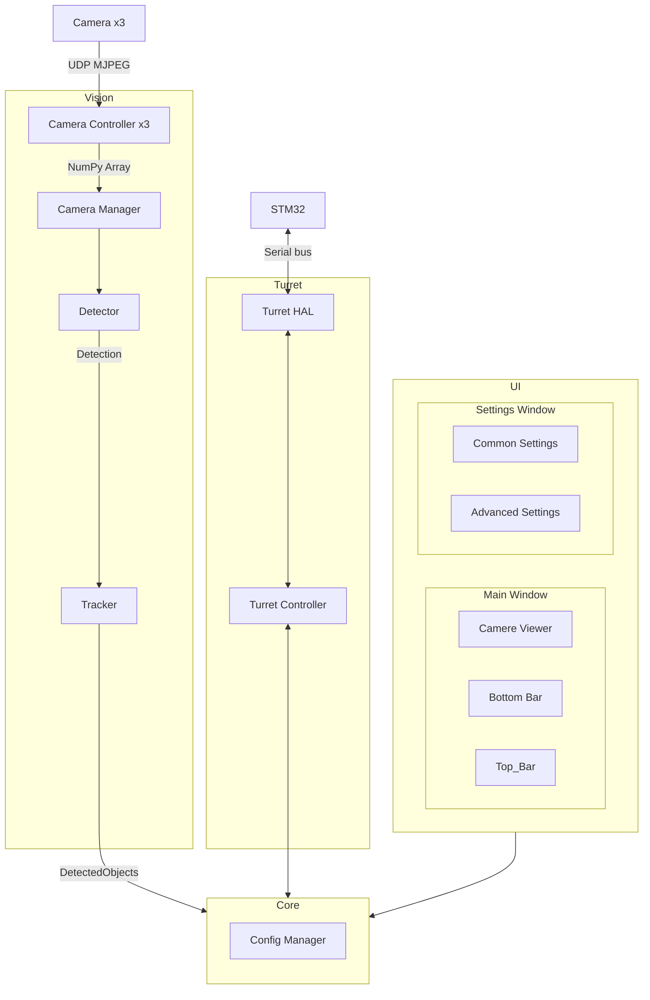

# Общая схема системы

Здесь представлена общая схема системы и почему были применены те или иные
протоколы, подходы. Подробное описание каждого узла смотреть в соответствующих документах

## Что нужно решить/уточнитить

[Проблемы и решения](./problems.md)

## Схема

## Core

Ядро системы — это «диспетчерская», которая управляет взаимодействием всех частей программы. Оно не выполняет тяжёлые вычисления, а только координирует их работу и передаёт данные между модулями через очереди сообщений.

### Как работает Core (паттерн Медиатор)

Представьте, что у вас есть несколько отделов (модулей), и им нужно обмениваться информацией. Вместо того чтобы каждый отдел звонил напрямую друг другу (что создаёт хаос), вы ставите секретаря (Core). Все отделы сообщают секретарю, что им нужно, а секретарь перенаправляет эту информацию тому, кому она адресована. Это и есть **паттерн Медиатор** – центральный узел, который упрощает связи между компонентами.

В нашей системе это реализовано через **очереди сообщений**. Каждый модуль работает независимо и общается с другими только через Core, кладя сообщения в очереди и забирая их оттуда.

### Очереди сообщений

Core содержит следующие потокобезопасные очереди (производитель → потребитель):

- `frame_queue` – от потока захвата к потоку обработки (кадры NumPy Array)
- `object_queue` – от потока обработки к потоку управления турелью (`DetectedObject`)
- `command_queue` – от UI (или Core) к потоку управления турелью (команды)
- `status_queue` – от потока управления турелью к UI (состояние)
- `ui_command_queue` – от UI к Core (изменение настроек) – может быть объединена с `command_queue`, но для ясности разделим.
- `ui_status_queue` – от Core к UI (обновления состояния для отображения) – может быть объединена с `status_queue`.

Core не обрабатывает содержимое сообщений, а только предоставляет механизм их передачи. Это обеспечивает слабую связанность – замена детектора не затрагивает турель или UI.

### Потоки (упрощённая модель)

Для эффективной работы используется **3 дополнительных потока** (плюс главный поток UI):

1. **Поток захвата видео** – непрерывно получает кадры с камер и помещает их в `frame_queue`.
2. **Поток обработки (Vision Pipeline)** – забирает кадры из очереди, последовательно выполняет детекцию и трекинг, затем кладёт результат (`DetectedObject`) в `object_queue`.
3. **Поток управления турелью** – слушает `command_queue` (и возможно `status_queue`), отправляет команды на STM32 и периодически публикует текущее состояние в `status_queue`.
4. **Главный поток (UI)** – отвечает за интерфейс, читает `ui_status_queue` для обновления информации и отправляет команды пользователя через `ui_command_queue`.

Все очереди потокобезопасны (используется `queue.Queue`), поэтому синхронизация не требуется.

### Config Manager

- Хранит все настройки в едином словаре (в памяти).
- Поддерживает загрузку/сохранение из файла (JSON) при старте и по запросу.
- Оповещает подписанные модули об изменениях настроек через callback или через отдельную очередь (на начальном этапе можно использовать callback, чтобы не плодить очереди). 
- Любой модуль может подписаться на обновления нужных разделов конфигурации.

### Супервизор (опционально)

Core может отслеживать состояние потоков (например, через таймауты). При зависании или ошибке – перезапускать проблемный поток. Реализуется на втором этапе разработки.

## Vision

- `Camera x3` - Три RPi, каждая с камерой и подключенна по ethernet в общую локальную сеть.

    - Две из них используются для стереозрения и прицеливания, имеют малый угол обзора
    - Третья используется для наблюдения, имеет большой угол обзора

- `Camera Controller x3` - Кажыдй подключается к своей камере, получает кадры, преобразует в удобный формат.

    Камеры передают изображения в формате **MJPEG** по **UDP** с помощью **Gstreamer Raw UDP**.
    
    Использование **RTP** (временных меток) будет включаться и отключаться параметром в настройках ***Добавить ссылку***. 
    Вкючение этого параметра может помочь устранить артефакты видеопотока, если кадры начнуть сыпаться, но прибавить
    ~70мс задержки (по расчетам Deepseek).

    Отдельный **ffmpeg** бинарник больше **не используем**, т.к. не дает никаких преимуществ
    по сравнению с python-библиотеками

    На выходе получаем **NumPy Array**, с которым хорошо умеют работать OpenCV и PyQt.

    В случае обрыва соединения должны происходить попытки переподключения до тех пор, пока соединение не восстановится

!!! warning "TODO"
    Добавить ссылку, когда появится файл `Camera Controller`

    RTP делать обязательным? Без него не будет рассинхрона кадров? Это важно для стереозрения. Есть способы еще как-то это решить?
 

- `Camera Manager` - Управляет `Camera Controller`-ами и предоставляет доступ к кадрам другим модулям

    Назначает адреса подключения к камерам. Хранит очередь кадров с каждой камеры (или последние кадры?)

!!! warning "TODO"
    Уточнить

- `Detector` - Занимается обнаружением объектов по заданным признакам

    Это родительский класс, который описывает, какие данные должны быть на входе и на выходе. Дочерние классы
    должны будут содержать уже саму логику работы. Это сделано для того, чтобы иметь возможность подключать
    разные детекторы с разными алгоритмами.

    Ищет в кадре объекты **в моменте, без привязки ко времени**. Обращает внимание на размер, соотношение сторон,
    расстояние, контраст с фоном, направление градиентов и другие признаки. Полный список этих признаков **еще
    предстоит отдельно составить. Добавить ссылку**. Обрабатывать эти признаки будет небольшая нейросеть (несколько десятков нейронов)

    На выходе получаем `Detection` - Дата-класс, который содержит координаты рамок и набор признаков для каждого наблюдения, в моменте,
    **без привязки к определенному объекту**. Содержит данные, по которым `Tracker` будет определять отдельные объекты, отслеживать
    их и сопровождать. 

!!! warning "TODO"
    Уточнить, добавить ссылки

- `Tracker` - Привязывает рамки к **определенным объектам**.

    По аналогии с детектором, является родительским классом. Логику работы будут содержать дочерние.

    Отслеживает `Detection`ы на нескольких последних кадрах и соотносит их между собой как отдельные движущиеся объекты.
    На этом этапе появляется информация о скорости и траектории движения.

    В результате работы получает `DetectedObject` - Дата-класс, который содержит информацию о **конкретном объекте** отслеживая
    информацию о нем во времени. Объекту выдается номер, по которому при необходимости можно будет обратиться, например, для
    наведения на него.

    Связку `Camera Manager -> Detector -> Tracker` можно будет настроить для каждой камеры отдельно, или же не настраивать ее вовсе, оставляя видеопоток без обработки. Настраивается в самом модуле `Vision`.

!!! warning "TODO"
    Не описано на каком этапе здесь появляется стереозрение. Оформить его как детектор, принимающий два изображения?

## Turret

- `Turret HAL` - низкоуровневое общение с STM32 по последовательной шине для управления шаговыми двигателями и спуском

    Шина не поддерживает передачу сообщений в обе стороны одновременно, только в одну. Вынужденная мера для защиты от помех
    при передаче данных по длинному проводу

- `Turret Controller`  - Высокоуровневое API для ядра и выполнение вспомогательных операций

    К вспомогательным операциям относятся:
    - запуск калибровок
    - компенсация люфта
    - PI-регулятор для наведения на цель
    - и т.д.

## UI

Написан на PyQt6

- `Main Window` - Главное окно, первое что видит пользователь при запуске

    Содержит:
    - виджет для отображения видеопотока и рамок, обработка клика внутри виджета и по рамкам
    - нижняя панель для быстрого переключения режимов и вывода информации
    - верхняя панель с выпадающими списками для настроек и прочих действий

- `Settings Window` - окно с основными настройками

    Содержит базовые настройки и кнопку для открытия расширенных настроек

