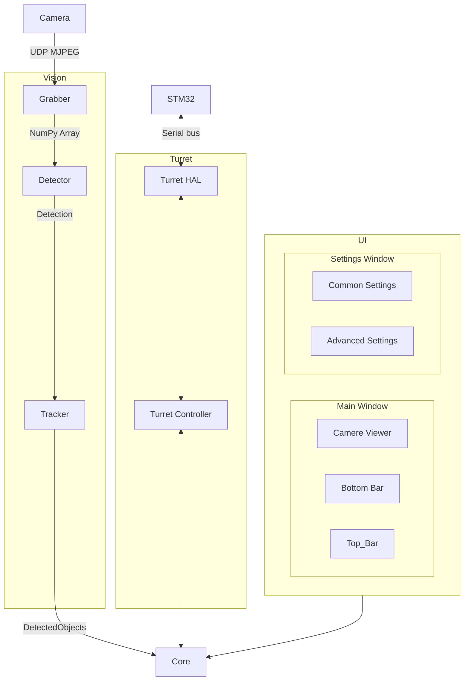

# Общая схема системы

Здесь представлена общая схема системы и почему были применены те или иные
протоколы, подходы. Подробное описание каждого узла смотреть в соответствующих документах

## Что нужно решить/уточнитить

[Проблемы и решения](./problems.md)

## Схема

## Vision

- `Camera` - RPi с камерой, подключенная по ethernet.

- `UDP MJPEG` - Передача изображения в формате MJPEG по UDP.

    Предлагается использовать для начала **Gstreamer Raw UDP** (без RTP, временных меток).
    Если будут артефакты и кадры будут сыпаться, стоит ввести RTP, но это прибавит
    ~70мс задержки (по расчетам Deepseek). Стоит поэкспериментировать и подобрать
    хорошие настройки для этой связки. По идее ничего лучше в рамках передачи видеопотока
    по ethernet не найдено.

    Отдельный **ffmpeg** бинарник больше **не используем**, т.к. не дает никаких преимуществ
    по сравнению с python-библиотеками

- `Grabber` - Подключается к камере, получает кадры, преобразует в удобный формат.

- `NumPy Array` - Стандартный тип данных для изображений, который OpenCV и PyQt хорошо понимают.

- `Detector` - Занимается обнаружением объектов по заданным признакам

    Ищет в кадре объекты **в моменте, без привязки ко времени**. Обращает внимание на размер, соотношение сторон,
    расстояние, контраст с фоном, направление градиентов и другие признаки. Полный список этих признаков **еще
    предстоит отдельно составить**. Обрабатывать эти признаки будет небольшая нейросеть (несколько десятков нейронов)

- `Detection` - Дата-класс, который содержит координаты рамок и набор признаков.

    Предназначен для хранения найденных рамок в моменте, **без привязки к определенному объекту**. 
    Содержит данные, по которым `Tracker` будет определять отдельные объекты, отслеживать их и сопровождать.

- `Tracker` - Привязывает рамки к **определенным объектам**.

    Отслеживает `Detection`ы на нескольких последних кадрах и соотносит их между собой как отдельные движущиеся объекты.
    На этом этапе появляется информация о скорости и траектории движения.

- `DetectedObject` - Дата-класс, который содержит информацию о **конкретном объекте** отслеживая информацию о нем во времени.

    Объекту выдается номер, по которому при необходимости можно будет обратиться, например, для наведения на него.

## Turret

- `Turret HAL` - низкоуровневое общение с STM32 по последовательной шине для управления шаговыми двигателями и спуском

    Шина не поддерживает передачу сообщений в обе стороны одновременно, только в одну. Вынужденная мера для защиты от помех
    при передаче данных по длинному проводу

- `Turret Controller`  - Высокоуровневое API для ядра и выполнение вспомогательных операций

    К вспомогательным операциям относятся:
    - запуск калибровок
    - компенсация люфта
    - PI-регулятор для наведения на цель
    - и т.д.

## UI

Написан на PyQt6

- `Main Window` - Главное окно, первое что видит пользователь при запуске

    Содержит:
    - виджет для отображения видеопотока и рамок, обработка клика внутри виджета и по рамкам
    - нижняя панель для быстрого переключения режимов и вывода информации
    - верхняя панель с выпадающими списками для настроек и прочих действий

- `Settings Window` - окно с основными настройками

    Содержит базовые настройки и кнопку для открытия расширенных настроек

