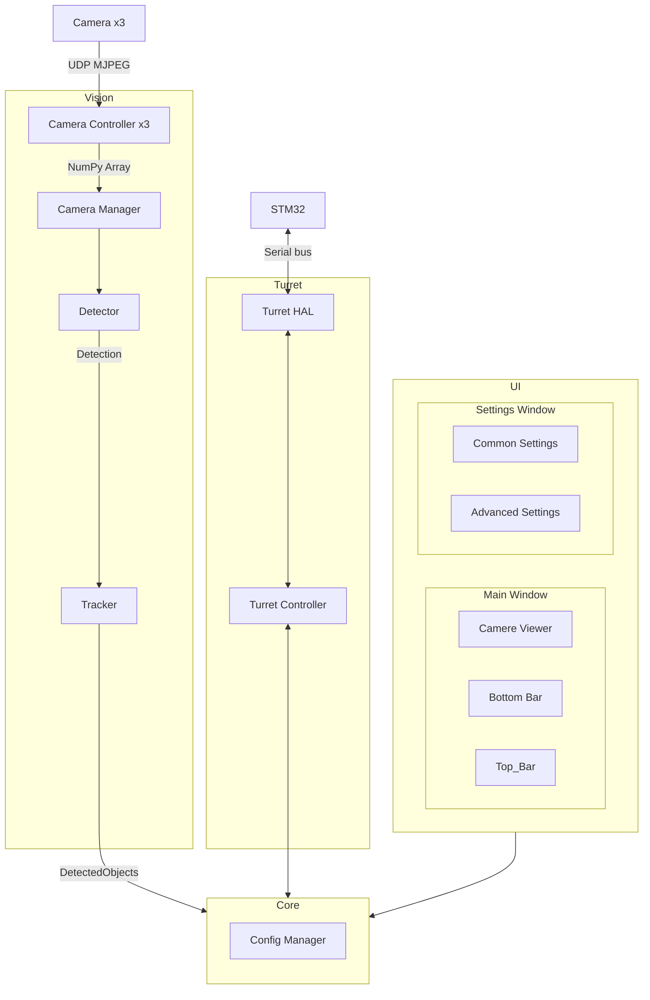

# Общая схема системы

Здесь представлена общая схема системы и почему были применены те или иные
протоколы, подходы. Подробное описание каждого узла смотреть в соответствующих документах

## Что нужно решить/уточнитить

[Проблемы и решения](./problems.md)

## Схема

## Core

Ядро системы — это «диспетчерская», которая управляет взаимодействием всех частей программы. Оно не выполняет тяжёлые вычисления, а только координирует их работу и передаёт данные между модулями через очереди сообщений.

### Как работает Core (паттерн Медиатор)

Представьте, что у вас есть несколько отделов (модулей), и им нужно обмениваться информацией. Вместо того чтобы каждый отдел звонил напрямую друг другу (что создаёт хаос), вы ставите секретаря (Core). Все отделы сообщают секретарю, что им нужно, а секретарь перенаправляет эту информацию тому, кому она адресована. Это и есть **паттерн Медиатор** – центральный узел, который упрощает связи между компонентами.

В нашей системе это реализовано через **очереди сообщений**. Каждый модуль работает независимо и общается с другими только через Core, кладя сообщения в очереди и забирая их оттуда.

### Очереди сообщений

Core содержит следующие потокобезопасные очереди (производитель → потребитель):

- `frame_queue` – от потока захвата к потоку обработки (кадры NumPy Array)
- `object_queue` – от потока обработки к потоку управления турелью (`DetectedObject`)
- `command_queue` – от UI (или Core) к потоку управления турелью (команды)
- `status_queue` – от потока управления турелью к UI (состояние)
- `ui_command_queue` – от UI к Core (изменение настроек) – может быть объединена с `command_queue`, но для ясности разделим.
- `ui_status_queue` – от Core к UI (обновления состояния для отображения) – может быть объединена с `status_queue`.

Core не обрабатывает содержимое сообщений, а только предоставляет механизм их передачи. Это обеспечивает слабую связанность – замена детектора не затрагивает турель или UI.

### Потоки (упрощённая модель)

Для эффективной работы используется **3 дополнительных потока** (плюс главный поток UI):

1. **Поток захвата видео** – непрерывно получает кадры с камер и помещает их в `frame_queue`.
2. **Поток обработки (Vision Pipeline)** – забирает кадры из очереди, последовательно выполняет детекцию и трекинг, затем кладёт результат (`DetectedObject`) в `object_queue`.
3. **Поток управления турелью** – слушает `command_queue` (и возможно `status_queue`), отправляет команды на STM32 и периодически публикует текущее состояние в `status_queue`.
4. **Главный поток (UI)** – отвечает за интерфейс, читает `ui_status_queue` для обновления информации и отправляет команды пользователя через `ui_command_queue`.

Все очереди потокобезопасны (используется `queue.Queue`), поэтому синхронизация не требуется.

### Config Manager

- Хранит все настройки в едином словаре (в памяти).
- Поддерживает загрузку/сохранение из файла (JSON) при старте и по запросу.
- Оповещает подписанные модули об изменениях настроек через callback или через отдельную очередь (на начальном этапе можно использовать callback, чтобы не плодить очереди). 
- Любой модуль может подписаться на обновления нужных разделов конфигурации.

### Супервизор (опционально)

Core может отслеживать состояние потоков (например, через таймауты). При зависании или ошибке – перезапускать проблемный поток. Реализуется на втором этапе разработки.

## Vision

Модуль Vision отвечает за получение видеопотока с трёх камер, обнаружение объектов и их сопровождение. Он состоит из модуля получения кадров (`Camera Manager`), детектора и трекера, которые работают последовательно в одном потоке обработки.

### Камеры (Camera x3)

- Три Raspberry Pi, каждая с камерой, подключены по Ethernet в общую локальную сеть.
- **Две камеры** (стереопара) имеют малый угол обзора и используются для стереозрения и прицеливания.
- **Третья камера** имеет большой угол обзора и используется для общего наблюдения.

### Camera Controller (x3)

Каждый контроллер – это отдельный воркер, который подключается к своей камере, получает видеопоток и преобразует его в удобный формат.

- Передача изображений осуществляется в формате **MJPEG** по **UDP** с помощью **Gstreamer Raw UDP**.
- **RTP** (временные метки) опционально включается параметром в настройках. По умолчанию RTP выключен, чтобы минимизировать задержку. При возникновении артефактов видеопотока (рассинхрон кадров) пользователь может включить RTP – это добавит ~70 мс задержки, но повысит стабильность.
- На выходе контроллер отдаёт кадр в виде **NumPy Array** (формат, совместимый с OpenCV и PyQt).
- При обрыве соединения контроллер автоматически пытается переподключиться до восстановления связи.
- Реализация использует Python-библиотеки (OpenCV, Gstreamer bindings); отдельный бинарник ffmpeg не применяется.

### Camera Manager

Модуль получения кадров управляет тремя контроллерами:

- Назначает IP-адреса и порты для подключения к каждой камере (конфигурируется через настройки).
- Предоставляет доступ к кадрам: хранит **последний полученный кадр** для каждой камеры (перезаписывается при поступлении нового). Это обеспечивает актуальность данных без накопления очереди.
- При необходимости может предоставлять **синхронизированную пару кадров** с двух стереокамер, если в настройках включено стереозрение. Если стереозрение отключено, синхронизация не выполняется, и каждая камера работает независимо.

### Detector

Детектор отвечает за обнаружение объектов **в текущем кадре (моментально, без учёта времени)**. Он является абстрактным классом, что позволяет подключать разные алгоритмы. В системе предусмотрено два основных подхода (выбор через конфигурацию):

#### Подход 1. Скользящее окно с разбиением на клетки

- Окно фиксированного размера (например, 64×64 или 128×128 пикселей) перемещается по изображению с заданным шагом (например, 8 или 16 пикселей).
- Внутри каждого окна оно разбивается на клетки (например, 16×16 пикселей). Для каждой клетки вычисляются признаки (гистограммы градиентов, яркость, текстура и т.п.) – список признаков описан ниже.
- Все признаки из всех клеток объединяются в длинный вектор, который подаётся на вход полносвязной нейросети-классификатора (~50–100 нейронов).
- Если нейросеть выдаёт положительный ответ, координаты окна становятся рамкой `Detection`.
- **Применимость:** хорошо работает для объектов, размер которых сопоставим с размером окна. Для маленьких объектов требует использования пирамиды масштабов или уменьшения размера клетки.

#### Подход 2. Поиск областей интереса (ROI) с последующей проверкой

- Сначала применяется быстрый алгоритм выделения **областей-кандидатов** (ROI), которые потенциально содержат объекты. Для поиска контрастных объектов используется выделение градиентов (например, оператор Canny), пороговая обработка или метод вычисления дисперсии яркости.
- Полученные ROI – это прямоугольники, внутри которых вероятно наличие объекта.
- Для каждого ROI запускается нейросеть на векторе признаков (аналогично первому подходу, но только внутри ROI) для подтверждения и уточнения рамки.
- **Применимость:** более эффективен для поиска контрастных объектов любого размера, включая очень маленькие (меньше клетки), так как этап выделения ROI работает на уровне пикселей и не зависит от размера клетки.

**Рекомендация:** по умолчанию используется **второй подход**, так как он лучше соответствует задаче поиска контрастных объектов и экономит вычислительные ресурсы.

#### Признаки для нейросети

Для каждого кандидата (рамки или ROI) вычисляется вектор из **45 числовых признаков**. Признаки делятся на группы:

| Группа | Признаки | Размерность | Вычисление (OpenCV) |
|--------|----------|-------------|----------------------|
| Геометрические | ширина, высота, площадь, соотношение сторон, координаты центра (x,y) нормализованные | 5 | `cv2.boundingRect`, нормализация на размер кадра |
| Яркостные | средняя яркость, дисперсия, минимум, максимум, размах | 4 | `cv2.meanStdDev`, `cv2.minMaxLoc` |
| Контрастные | среднеквадратичный контраст, контраст по Веберу | 2 | формулы на основе статистики яркости |
| Гистограммные | 8-биновая гистограмма яркости (нормированная) | 8 | `cv2.calcHist` с 8 бинами |
| Цветовые (если камера цветная) | средние B,G,R и дисперсии, гистограммы по 4 бинам на канал | 12 | `cv2.meanStdDev`, `cv2.calcHist` (3 канала × 4 бина) |
| Текстурные (GLCM) | энергия, энтропия, контраст, корреляция | 4 | `skimage.feature.graycomatrix` и `graycoprops` (или ручная реализация) |
| Градиентные | 8-биновая гистограмма ориентаций градиентов (без блоков) + средняя магнитуда | 8 | `cv2.Sobel`, вычисление углов и магнитуд, гистограмма |
| Пространственные | положение рамки относительно центра кадра, расстояние до центра | 2 | нормализованные координаты |

**Итого:** 5+4+2+8+12+4+8+2 = **45 признаков**.

Вычисление признаков выполняется в методе `extract_features(roi)` внутри конкретного детектора. Вектор признаков сохраняется в дата-классе `Detection` как поле `features: np.ndarray` (тип float32).

Детектор выдаёт список `Detection` для каждого обнаруженного объекта. Каждый `Detection` содержит:
- координаты ограничивающей рамки (x, y, w, h),
- набор признаков (`features`),
- уверенность (confidence score) – опционально.

Важно: `Detection` не идентифицирует объект во времени – это просто «наблюдение» на данном кадре.

### Tracker

Трекер принимает список `Detection` с нескольких последовательных кадров и привязывает их к **конкретным объектам** (выполняет ассоциацию во времени). Является абстрактным классом, что позволяет использовать разные алгоритмы (например, венгерский алгоритм, фильтр Калмана, SORT).

Результат работы трекера – список `DetectedObject`, где каждый объект имеет:
- уникальный идентификатор (номер),
- текущие координаты рамки,
- предысторию (последние положения) – опционально,
- скорость и траекторию (вычисляется на основе изменений координат),
- опциональное поле `features` (вектор признаков из последнего `Detection`) – может быть `None`; на начальном этапе не используется для ассоциации, но оставлено для будущих улучшений.

### Стереозрение

Стереозрение выполняется **после трекинга** – для каждого объекта из `DetectedObject` (имеющего ID) вычисляется глубина по его текущей рамке, используя синхронизированные кадры с двух стереокамер (левой и правой). Это позволяет:
- Снизить вычислительную нагрузку (глубина считается только для выбранных объектов, а не для всего кадра).
- Упростить архитектуру (не нужно тащить глубину через трекер).

Порядок работы со стереопарой:
1. Получаем кадры с левой и правой камеры (синхронизированные по времени). Синхронизация включается параметром в настройках.
2. Запускаем детектор и трекер на левом кадре (или правом – настраивается) – получаем объекты с рамками.
3. Для каждого объекта, для которого нужна глубина (например, для текущей цели), выполняем стереосопоставление (блоковое сопоставление или полуглобальный алгоритм) внутри его рамки.
4. Вычисляем расстояние до объекта и добавляем его в `DetectedObject`.

Если стереозрение отключено, то расстояние для наведения вводится пользователем вручную через UI (например, в поле ввода) и передаётся в Core для турели.

### Поток обработки (Vision Pipeline)

Детектор и трекер работают **последовательно в одном потоке** (поток обработки):
1. Захватчик (`Camera Manager`) помещает кадры в `frame_queue`. Если стереозрение включено, в очередь помещается пара синхронизированных кадров (левый и правый).
2. Поток обработки забирает кадр (или пару кадров) из очереди.
3. Передаёт кадр в детектор, получает список `Detection`.
4. Передаёт список `Detection` в трекер, получает список `DetectedObject` (с обновлёнными идентификаторами и историей).
5. **Если стереозрение включено** – для каждого объекта из `DetectedObject` вычисляется глубина по его рамке, используя второй кадр из пары, и добавляется в объект.
6. Кладет `DetectedObject` в `object_queue` для дальнейшего использования турелью и UI.

Такая последовательная схема упрощает синхронизацию и отладку. При необходимости частоту обработки можно регулировать (например, обрабатывать каждый второй кадр), чтобы не перегружать систему.

### Конфигурация

Конфигурация модуля Vision хранится в `Config Manager` и делится на две части: **глобальные настройки** (для всего модуля) и **настройки для каждой камеры**.

#### Глобальные настройки (для всего Vision)
- `stereo_enabled: bool` – включено ли стереозрение для стереопары (двух камер с малым углом обзора). Если выключено, синхронизация кадров не производится, и расстояние для наведения задаётся пользователем вручную через UI.

#### Настройки для каждой камеры (индивидуальные)
Для каждой из трёх камер (две стерео + одна обзорная) можно независимо задать:
- `enabled: bool` – включена ли обработка видеопотока (детекция + трекинг). Если выключено, кадры передаются только на отображение в UI без анализа.
- `detector_class: str` – имя класса детектора (например, `"SlidingWindowDetector"` или `"ROIBasedDetector"`).
- `tracker_class: str` – имя класса трекера (например, `"KalmanTracker"` или `"HungarianTracker"`).

**Важно:** параметры алгоритмов (размер окна, шаг, пороги, коэффициенты фильтра и т.п.) **не хранятся в Config Manager**. Каждый конкретный детектор и трекер имеет собственный внутренний словарь параметров, который передаётся в его конструктор при создании экземпляра. Это позволяет гибко настраивать каждый алгоритм независимо, не загромождая общий конфиг.

## Turret

Модуль Turret отвечает за управление физической турелью: наведение по двум осям (X и Y) и приведение в действие спускового механизма. Он состоит из двух уровней: низкоуровневого драйвера (`Turret HAL`) для общения с STM32 и высокоуровневого контроллера (`Turret Controller`), который реализует логику наведения, калибровки и компенсации.

### Turret HAL (Hardware Abstraction Layer)

Низкоуровневый слой, который непосредственно общается с STM32 по последовательной шине (UART). Выполняет следующие задачи:

- **Отправка команд** – формирует пакеты по байтовому протоколу и отправляет их через последовательный порт.
- **Приём ответов** – читает ответы от STM32 (подтверждения, статус, ошибки).
- **Обработка таймаутов и повторных попыток** – если ответ не получен в течение заданного времени, команда повторяется (до N раз), после чего фиксируется ошибка.

Шина работает **только в одну сторону** (полудуплекс) – это вынужденное решение для защиты от помех при передаче данных по длинному проводу. Поэтому протокол построен так, чтобы минимизировать коллизии: команда отправляется, затем HAL ожидает ответа, прежде чем отправить следующую команду.

#### Протокол обмена с STM32

Используется **простой байтовый протокол** с фиксированной структурой пакета:

| Байт(ы) | Назначение |
|---------|------------|
| 0       | Преамбула 1: `0xAA` |
| 1       | Преамбула 2: `0x55` |
| 2       | Длина пакета (количество байт данных) |
| 3       | Код команды |
| 4..11   | Данные (до 8 байт, опционально) |
| 12..13  | CRC16 (контрольная сумма всего пакета, начиная с преамбулы) |

Конкретный набор команд, их коды и форматы данных будут определены на этапе разработки совместно с прошивкой STM32.

HAL реализует таймауты (например, 100 мс) и повторные попытки (до 3 раз). Все ошибки логируются и передаются в Core через `status_queue`.

### Turret Controller

Высокоуровневый слой, который использует `Turret HAL` для выполнения команд, но также содержит логику, необходимую для точного наведения и стабильной работы.

**Основные функции:**

1. **Наведение на цель** – получает от Core команды управления движением. Возможны два режима:

   - **Режим относительного смещения** – Turret Controller получает приращение по каждой оси (ΔX, ΔY) и перемещает турель на указанное количество шагов/угловых единиц.
   - **Режим сопровождения** – Core передаёт ошибку рассогласования (отклонение цели от прицельной точки в угловых единицах) отдельно по каждой оси. Turret Controller использует **PI-регулятор**, который на основе этой ошибки вычисляет требуемую скорость движения по каждой оси, чтобы минимизировать отклонение и совместить цель с прицелом.

   PI-регулятор работает независимо для каждой оси и выдаёт команды скорости (или шага) через HAL.

2. **Компенсация люфта** – при смене направления движения добавляется небольшое смещение, чтобы компенсировать механический люфт шестерён. Величина компенсации настраивается **отдельно для каждой оси** (X и Y), так как люфт может различаться.

3. **Калибровка** – процедура, включающая:
   - **Пристрелку** – настройка смещения прицела относительно механической оси турели (поправка на неточности установки).
   - **Калибровку компенсации люфта** – определение величины люфта для каждой оси 

4. **Обработка команд от Core** – слушает `command_queue` и выполняет команды (конкретный формат команд будет определён позднее).

5. **Публикация состояния** – периодически (или по запросу) отправляет текущее положение, статус и ошибки в `status_queue` для Core и UI.

### Поток управления турелью

`Turret Controller` работает в **отдельном потоке**, чтобы не блокировать другие модули (особенно при длительных операциях, таких как калибровка или перемещение на большое расстояние).

Цикл работы потока:
1. Проверить `command_queue` – если есть новая команда, обработать её.
2. Если нет команд – проверить, нужно ли обновить состояние (например, по таймеру) и отправить статус в `status_queue`.
3. Если ведётся наведение – выполнить шаг PI-регулятора (в режиме сопровождения) или отработать заданное смещение, отправить команду через HAL.
4. Обработать ответы от HAL (если они пришли).
5. Небольшая задержка (sleep) для предотвращения перегрузки CPU.

### Конфигурация

В `Config Manager` для модуля Turret хранятся следующие настройки:

- `port: str` – имя последовательного порта (например, `/dev/ttyUSB0`).
- `baudrate: int` – скорость обмена (по умолчанию 115200).
- `timeout_ms: int` – таймаут ответа от STM32 (мс).
- `retry_count: int` – количество повторных попыток при сбое.
- `pid_kp_x: float` – пропорциональный коэффициент PI-регулятора для оси X.
- `pid_ki_x: float` – интегральный коэффициент PI-регулятора для оси X.
- `pid_kp_y: float` – пропорциональный коэффициент PI-регулятора для оси Y.
- `pid_ki_y: float` – интегральный коэффициент PI-регулятора для оси Y.
- `backlash_compensation_x: float` – величина компенсации люфта для оси X (в шагах или углах).
- `backlash_compensation_y: float` – величина компенсации люфта для оси Y (в шагах или углах).

Эти параметры могут изменяться через UI в окне расширенных настроек и применяются динамически (без перезапуска модуля) через подписку на события `Config Manager`.

### Взаимодействие с Core

- **Входящие команды** – Core помещает команды в `command_queue` (формат команд будет определён позднее).
- **Исходящий статус** – Turret Controller публикует в `status_queue` текущее состояние: положение, ошибки, готовность, режим работы.

Таким образом, Core выступает лишь как маршрутизатор, а Turret Controller самостоятельно решает, как выполнять команды и когда обновлять статус.

### Обработка ошибок

- Если STM32 не отвечает (таймаут), HAL повторяет команду до `retry_count` раз.
- При постоянной ошибке – в `status_queue` отправляется сообщение об ошибке, и Turret Controller переходит в безопасное состояние (останавливает моторы).
- UI отображает ошибку пользователю и предлагает выполнить калибровку или перезапустить модуль.

## UI

Пользовательский интерфейс написан на **PyQt6** и работает в главном потоке приложения. Он предоставляет оператору возможность наблюдать за видеопотоками, управлять турелью, настраивать систему и видеть текущее состояние всех модулей.

UI взаимодействует с Core через две очереди:
- `ui_command_queue` – отправка команд от UI к Core (изменение настроек, выбор цели, смена режима).
- `ui_status_queue` – получение обновлений состояния от Core (список `DetectedObject`, статус турели, ошибки, системные сообщения).

Для отображения видеопотоков UI обращается к **`Camera Manager`** напрямую (или через Core), получая последний кадр для каждой камеры. Кадры отображаются с наложенными рамками объектов (рамки рисуются UI на основе данных из `DetectedObject`, полученных через `ui_status_queue`). Это позволяет разделить получение видео и аналитику – UI не загружает обработку, а только отображает готовые данные.

---

### Главное окно (Main Window)

Главное окно – это основная рабочая область оператора. Оно содержит три ключевые зоны:

#### 1. Camera Viewer (виджет видеопотока)

- Отображает видеопоток с выбранной камеры (переключение между камерами – через кнопки или выпадающий список).
- Поверх видео рисуются **рамки обнаруженных объектов** (на основе данных `DetectedObject`):
  - Рамка активной цели (выбранной оператором) выделяется другим цветом (например, зелёным или мигающим).
  - Остальные рамки – нейтральным цветом (например, синим).
- Отображается информация об объектах внутри рамок или рядом с ними:
  - ID объекта (номер).
  - Расстояние (если стереозрение включено и глубина вычислена).
  - Скорость (если трекер её вычисляет).
- **Взаимодействие с оператором:**
  - Клик по рамке – **выбор цели**. Эта цель становится приоритетной для наведения.
  - Клик по пустому месту – **снять выбор** цели.
  - При выборе цели в Core отправляется команда через `ui_command_queue` (например, `{"command": "select_target", "id": 42}`).

#### 2. Нижняя панель (Bottom Bar)

Содержит элементы для быстрого управления и индикации состояния:

- **Кнопки переключения режимов сопровождения:**
  - `"Ближайшая"` – автоматически выбирать ближайший объект.
  - `"Самая быстрая"` – автоматически выбирать объект с максимальной скоростью.
  - `"Ручная"` – оператор выбирает цель кликом (режим по умолчанию).
- **Индикаторы состояния:**
  - Подключение к камерам (зелёный/красный индикатор для каждой камеры).
  - Подключение к STM32 (зелёный/красный).
  - Текущий статус турели (калибровка, наведение, ошибка, готовность).
- **Информационная строка:**
  - Текущий выбранный объект (ID, расстояние, скорость).
  - Количество обнаруженных объектов.
  - Частота кадров (FPS) обработки.

#### 3. Верхняя панель (Top Bar)

Содержит глобальные элементы управления:

- **Выпадающее меню `"Файл"`** – загрузка/сохранение конфигурации, выход.
- **Выпадающее меню `"Вид"`** – переключение между камерами, включение/отключение отображения рамок.
- **Кнопка `"Настройки"`** – открывает окно настроек.
- **Кнопка `"Калибровка"`** – запускает калибровку турели (пристрелка и компенсация люфта).
- **Кнопка `"Экстренная остановка"`** – немедленно останавливает все моторы (отправляет команду `STOP` через Core).
- **Индикатор системных ошибок** – иконка, меняющая цвет при возникновении ошибок (по клику показывает подробности).

---

### Окно настроек (Settings Window)

Открывается по кнопке `"Настройки"` из главного окна. Разделено на две вкладки или области:

#### Базовые настройки
- Выбор последовательного порта для STM32.
- Включение/отключение стереозрения (`stereo_enabled`).
- Включение/отключение обработки для каждой камеры (`enabled` для каждой камеры).
- Выбор детектора и трекера для каждой камеры (выпадающие списки с доступными классами).
- Кнопка **"Расширенные настройки"** – открывает дополнительное окно (или раскрывает панель).

#### Расширенные настройки
- Параметры PI-регулятора (`Kp`, `Ki` для каждой оси).
- Компенсация люфта (`backlash_compensation` для X и Y).
- Таймауты и количество повторных попыток для связи с STM32.
- Параметры видеопотока (включение RTP, размер буфера).
- Настройки детектора (размер окна, шаг, пороги) и трекера (коэффициенты фильтра) – передаются в соответствующие классы через словари параметров (см. раздел `Vision.Конфигурация`).

Все изменения настроек применяются **динамически**: при сохранении UI отправляет обновлённые параметры в Core через `ui_command_queue`, а Core через `Config Manager` оповещает подписанные модули (Vision, Turret). Это позволяет менять параметры без перезапуска системы.

---

### Обработка ошибок и уведомления

- UI подписан на системные сообщения об ошибках через `ui_status_queue`.
- При возникновении ошибки (потеря связи с камерой, таймаут STM32, сбой детектора) UI отображает:
  - Всплывающее уведомление (Toast) в правом нижнем углу.
  - Индикатор ошибки на верхней панели (меняет цвет, по клику – подробное описание).
  - Запись ошибки в лог-файл (через Core).
- В случае критической ошибки (например, потеря STM32) UI предлагает пользователю выполнить перезапуск модуля или всей системы.

---

### Поток UI и производительность

UI работает в **главном потоке** приложения. Все тяжёлые операции (рендеринг видео, рисование рамок) выполняются с использованием аппаратного ускорения PyQt6, что обеспечивает плавный вывод даже при нескольких видеопотоках.

Чтобы не блокировать интерфейс, получение кадров из `Camera Manager` и обновление данных из `ui_status_queue` выполняется через **таймеры** (QTimer) с частотой ~30–60 Гц. Это гарантирует отзывчивость интерфейса и корректное отображение видеопотока без зависаний.

