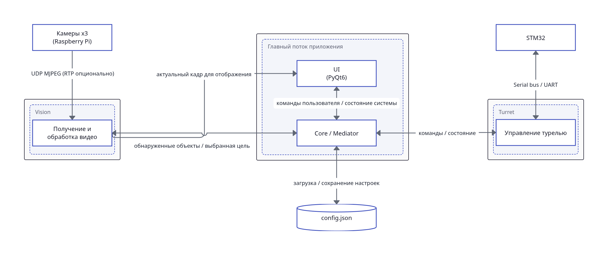

# Общая архитектура системы

Этот документ даёт краткое представление о том, как устроена система и как связаны её основные модули. Подробное описание каждого модуля вынесено в отдельные документы.

Этот документ активно дорабатывается. Исправления и уточнения, которые скоро будут внесены в него, см. в [Уточнения архитектуры](./architecture-updates.md)

## Основные модули

Система разделена на четыре основных программных модуля:

- `Vision` — получает видео с трёх камер, обнаруживает и сопровождает объекты, а также определяет дальность до выбранной цели.
- `Core` — координирует взаимодействие остальных модулей и хранит общее состояние системы, например `active_target_id`.
- `Turret` — отвечает за наведение, калибровку и обмен со STM32.
- `UI` — отображает видео и состояние системы, принимает действия пользователя и передаёт их в Core.

Core и UI являются отдельными логическими модулями, но выполняются в одном главном потоке приложения.

### Vision

Vision получает MJPEG-видеопотоки от трёх Raspberry Pi.

Каждая камера обслуживается отдельным `CameraController`. Кадры передаются через общий `Camera Manager`, который хранит только актуальное состояние каждой камеры.

Далее кадр проходит через `Vision Pipeline`:

- Detector обнаруживает объекты;
- Tracker связывает обнаружения между последовательными кадрами;
- Core сообщает Vision, какой объект выбран как активная цель;
- `Distance Provider` определяет дальность только до выбранной цели.

На первом этапе дальность может поступать из двух источников:

- `stereo` — расчёт по стереопаре;
- `manual` — постоянное значение, введённое пользователем.

Подробное описание:

[Vision](../modules/vision/index.md)

### Core

Core используется как Mediator между основными частями приложения.

Он:

- получает актуальные результаты Vision;
- хранит `active_target_id`;
- передаёт выбранную цель обратно в Vision;
- передаёт команды в Turret;
- получает состояние Turret;
- передаёт необходимое состояние в UI;
- работает с `Config Manager`;
- принимает предупреждения от `Supervisor`.

Core не выполняет тяжёлую обработку и не имеет собственного рабочего потока.

Подробное описание:

[Core](../modules/core/index.md)

### Turret

Turret отвечает за физическое управление турелью.

Он состоит из:

- `Turret Controller` — высокоуровневая логика наведения, PI-регулятор, компенсация люфта и калибровка;
- `Turret HAL` — низкоуровневый обмен со STM32 по UART.

Controller и HAL работают в одном отдельном потоке управления турелью.

Подробное описание:

[Turret](../modules/turret/index.md)

Протокол связи со STM32 описан отдельно:

[Протокол STM32](./serial-protocol.md)

### UI

UI написан на PyQt6 и выполняется в главном потоке приложения.

Он отвечает за:

- отображение видеопотока;
- отображение обнаруженных объектов и состояния системы;
- выбор цели;
- управление режимами;
- настройку системы;
- отображение ошибок и предупреждений.

Видеокадры UI получает напрямую из `Camera Manager`. Управляющие действия и состояние остальных модулей проходят через Core.

Подробное описание:

[UI](../modules/ui/index.md)

## Модель выполнения

В системе используется **6 прикладных потоков**:

1. **Главный поток приложения**
   - UI;
   - Core;
   - `Config Manager`;
   - `Supervisor`.

2. **CameraController #1**
   - получение видеопотока первой камеры.

3. **CameraController #2**
   - получение видеопотока второй камеры.

4. **CameraController #3**
   - получение видеопотока третьей камеры.

5. **Vision Pipeline**
   - Detector;
   - Tracker;
   - выбор активного объекта;
   - Distance Provider.

6. **Поток управления Turret**
   - Turret Controller;
   - Turret HAL;
   - обмен со STM32.

Внутренние служебные потоки, которые могут создавать GStreamer, OpenCV, Qt или другие библиотеки, в эту модель не входят.

## Обмен между потоками

Для межпотоковой передачи используются потокобезопасные очереди.

Основные правила:

- потоковые данные, для которых важно только актуальное состояние, не должны накапливаться;
- `frame_queue` и `object_queue` работают по принципу **latest only**;
- управляющие команды Turret передаются через FIFO `command_queue`;
- выбранная цель передаётся в Vision через `vision_command_queue`;
- состояние Turret передаётся через `status_queue`.

Если получателем является Core, рабочий поток после записи данных дополнительно отправляет Qt-сигнал. Он только уведомляет главный поток о появлении данных; сами данные остаются в очереди.

Подробное устройство очередей описано в документации соответствующих модулей.

## Конфигурация

Общая конфигурация хранится в `Config Manager`, который является частью Core.

При запуске настройки загружаются из `config.json`. Изменения из UI проходят через Core и затем передаются соответствующим модулям.

Подробная структура:

[Конфигурация](./configuration.md)

## Контроль состояния и восстановление

Для контроля фоновых частей системы используется `Supervisor`.

Vision и Turret передают heartbeat или информацию о своём состоянии. Если обновления не поступают дольше допустимого времени, Supervisor сообщает Core о проблеме, а UI показывает её пользователю.

Локальное восстановление выполняет тот модуль, которому принадлежит ресурс. Например, при потере видеопотока переподключением занимается соответствующий `CameraController`.

Автоматический перезапуск зависших потоков пока не считается обязательной частью первой реализации.

## Логирование

Логирование является общим сервисом приложения и используется всеми модулями.

В лог записываются важные события, предупреждения и ошибки, например:

- запуск и завершение компонентов;
- подключение и потеря оборудования;
- переподключение камер;
- ошибки Vision;
- ошибки Turret и STM32;
- предупреждения Supervisor.

Логирование не показано на архитектурных диаграммах, чтобы не перегружать их связями.

## Потеря видеосигнала

`Camera Manager` хранит время получения последнего кадра.

Если новый кадр не поступает дольше `stale_timeout`, UI оставляет последний полученный кадр на экране и показывает поверх него сообщение **«Нет видеосигнала»**.

Подробная логика описана в документации Vision и GUI.

## Режимы симуляции

Для разработки без реального оборудования предусмотрены два независимых режима:

- Vision может использовать видеофайл, изображения, синтетический генератор или виртуальную камеру вместо физической Raspberry Pi камеры;
- Turret может использовать эмулятор STM32 вместо реального контроллера.

Остальные компоненты должны работать через те же интерфейсы независимо от того, используется реальное оборудование или симуляция.

## Завершение приложения

При штатном завершении Core координирует остановку системы.

Необходимо:

- прекратить приём новых пользовательских команд;
- безопасно остановить Turret;
- завершить Vision Pipeline;
- остановить три `CameraController`;
- сохранить необходимые настройки;
- завершить приложение после остановки рабочих потоков.

Точный порядок и таймауты завершения будут дополнительно проверены во время архитектурного аудита.

## Открытые вопросы

Вопросы, которые ещё требуют архитектурного решения или проверки, собраны отдельно:

[Открытые вопросы](./problems.md)

К ним, в частности, относятся вопросы о:

- внутренних параметрах Detector и Tracker;
- политике динамического применения настроек;
- детализации heartbeat;
- поведении очередей состояния и ошибок;
- приоритете аварийной команды `STOP`;
- безопасном завершении и восстановлении после сбоев.
