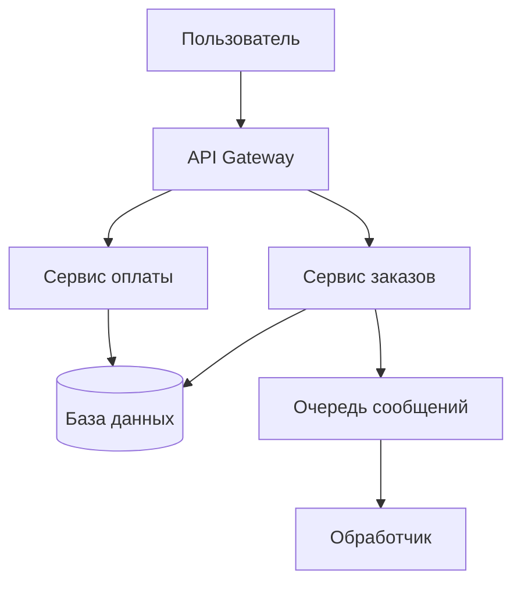
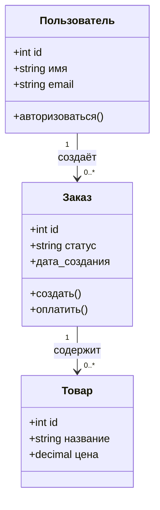

# Примеры архитектурных диаграмм в Mermaid

Просто чтобы оценить, какая выглядит лучше.

Предлагаю использовать:

- **Вариант 1** - для описания больших и общих систем.

- **Вариант 2** - Вместо первого, но если найдем нормальную тему, которая лучше выглядит и читается

- **Вариант 3** - Для точного описания конкретных объектов. Можно отказаться, оформляя по примеру документации Godot (табличкой).

Возможно стоит вообще использовать сторонний инструмент для рисования диаграмм, по типу draw.io, нужно поискать варианты

## 1. Flowchart (классическая блок-схема)

Подходит для процессов, алгоритмов и потоков данных.

---

## 2. Architecture Beta (архитектура сервисов с иконками)

Специализированный тип для облачных и микросервисных архитектур. Доступен с Mermaid v11.1.0+.

---

## 3. Class Diagram (диаграмма классов)

Показывает статическую структуру системы: классы, интерфейсы и их связи.

