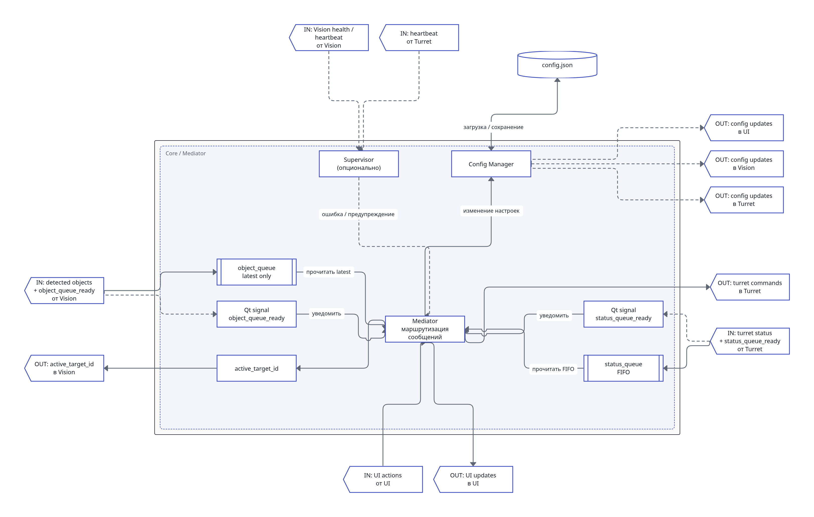
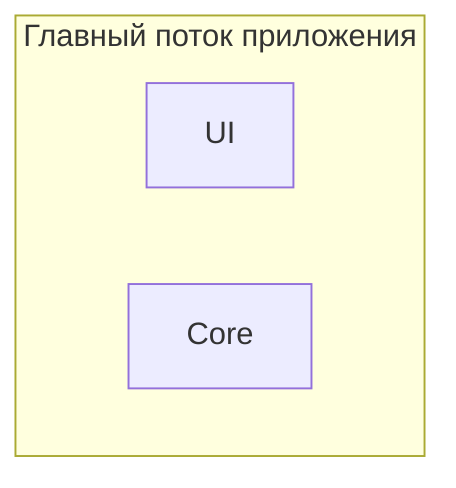
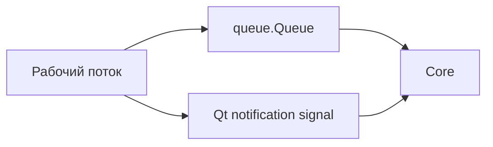
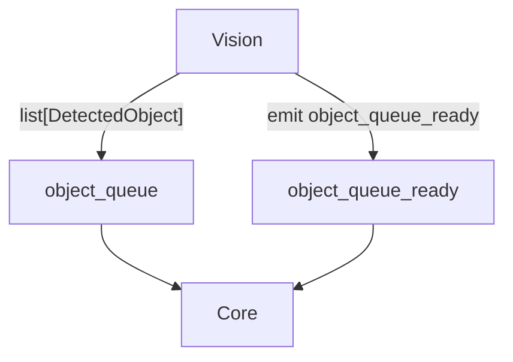
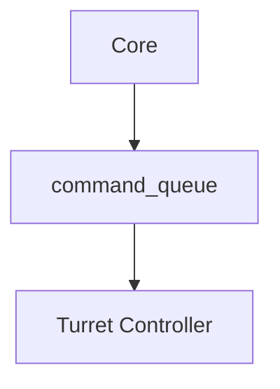
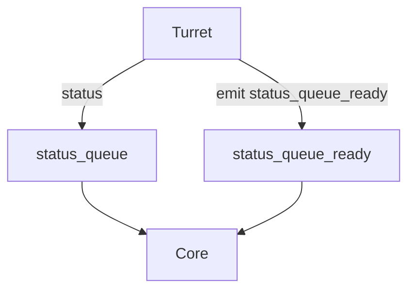

# Ядро системы (core)

Модуль `Core` связывает основные части приложения и хранит общее состояние, которое не должно принадлежать конкретному модулю. Он не выполняет тяжёлые вычисления: обработка видео выполняется в `Vision`, а управление оборудованием — в `Turret`.



## Роль Core

Core используется как **Mediator (посредник)** между модулями.

Вместо большого количества прямых связей между `Vision`, `UI` и `Turret` основные управляющие данные проходят через Core. Это уменьшает связанность модулей: например, UI не должен знать, как Turret Controller выполняет команду, а Turret не должен зависеть от устройства Vision Pipeline.

Core отвечает за:

- маршрутизацию данных и команд между модулями;
- хранение `active_target_id`;
- получение результатов Vision;
- получение состояния Turret;
- передачу команд в Vision и Turret;
- распространение состояния системы в UI;
- работу с `Config Manager`;
- получение предупреждений от `Supervisor`.

## Поток выполнения

Core **не имеет отдельного рабочего потока**.

Он работает в главном потоке приложения вместе с UI:



Это не означает, что Core является частью UI. Это два отдельных логических модуля, которые просто выполняются в одном потоке.

Тяжёлые или блокирующие операции внутри Core выполнять не следует, потому что они будут одновременно задерживать интерфейс PyQt6.

## Взаимодействие между потоками

Для передачи данных между рабочими потоками используются потокобезопасные очереди `queue.Queue`.

Если получателем является Core, одной очереди недостаточно: Core находится в главном Qt-потоке и не может блокироваться на `queue.get()` в ожидании сообщения.

Поэтому для входящих данных используется сочетание:



Производитель:

1. записывает данные в соответствующую очередь;
2. отправляет Qt-сигнал о том, что появились новые данные.

Core получает сигнал в главном потоке и сразу читает очередь.

Qt-сигнал используется только как уведомление. Сами данные передаются через очередь.

## Результаты Vision

Vision передаёт Core актуальный список обнаруженных объектов.

Для этого используется `object_queue`, которая находится на стороне Core.

### object_queue

`object_queue` имеет семантику **latest only**.

Core нужен текущий результат Vision, а не последовательное воспроизведение старых состояний. Если Vision успел подготовить несколько результатов до того, как Core обработал предыдущий, устаревшие состояния можно заменить самым новым.

Схема обмена:



После сигнала `object_queue_ready` Core читает самый свежий результат и обновляет состояние системы, необходимое UI и другим компонентам.

## Выбранная цель

Core хранит идентификатор выбранной цели:

```text
active_target_id
```

Это общее состояние системы, поэтому оно не хранится ни в UI, ни в Vision.

### Выбор цели пользователем

При выборе объекта в UI:

1. UI сообщает Core ID выбранного объекта.
2. Core записывает его в `active_target_id`.
3. Core передаёт новое значение в `Vision`.
4. Vision использует ID для поиска активной цели среди текущих `DetectedObject`.
5. `Distance Provider` определяет дальность только для этой цели.

Для передачи значения Core → Vision используется `vision_command_queue`, расположенная в модуле Vision.

Core не владеет этой очередью, а только записывает в неё управляющее сообщение.

При снятии выбора Core передаёт в Vision соответствующее состояние отсутствия активной цели.

## Взаимодействие с Turret

Core не управляет STM32 напрямую.

Высокоуровневая команда проходит по пути:



`command_queue` находится в модуле Turret и работает как обычная FIFO-очередь. В отличие от потоковых состояний Vision, управляющие команды нельзя автоматически заменять более новыми.

Конкретный набор и формат команд будет определён отдельно вместе с логикой Turret.

## Получение состояния Turret

Turret публикует состояние и ошибки через `status_queue`.

`status_queue` находится на стороне Core и на текущем этапе работает как FIFO.

Схема:



После получения `status_queue_ready` Core читает доступные сообщения и передаёт необходимые изменения в UI.

В дальнейшем на архитектурном аудите отдельно нужно проверить, следует ли разделить:

- текущее состояние, для которого обычно важно только последнее значение;
- события и ошибки, которые нельзя терять.

Пока используется одна FIFO-очередь.

## Взаимодействие с UI

UI и Core находятся в одном главном потоке, поэтому дополнительные `ui_command_queue` и `ui_status_queue` не используются.

Взаимодействие выполняется через:

- обычные вызовы методов;
- Qt-сигналы.

Примеры действий UI → Core:

- выбор или снятие цели;
- изменение режима;
- команда управления Turret;
- изменение настроек;
- запуск калибровки;
- экстренная остановка.

Примеры данных Core → UI:

- список обнаруженных объектов;
- выбранная цель;
- состояние Turret;
- ошибки и предупреждения;
- состояние модулей.

Для видеокадров Core не используется: `Camera Viewer` получает актуальные кадры от `Camera Manager`. Это позволяет не передавать большие изображения через центральный модуль без необходимости.

## Config Manager

`Config Manager` является частью Core и отвечает за единое хранение и распространение настроек приложения.

Основные задачи:

- загрузка конфигурации из `config.json` при запуске;
- хранение актуальной конфигурации в памяти;
- сохранение изменений;
- передача обновлений заинтересованным модулям.

Настройки разделяются по назначению и могут передаваться:

- в `Vision`;
- в `Turret`;
- в `UI`.

Core принимает изменение настроек от UI и передаёт его в `Config Manager`. После этого `Config Manager` уведомляет соответствующие модули.

Подробная структура конфигурации описана отдельно:

[Конфигурация](../../architecture/configuration.md)

Механизм доставки обновлений между потоками должен учитывать потокобезопасность. Точная реализация уведомлений будет окончательно проверена вместе со структурой конфигурации.

## Supervisor

`Supervisor` предназначен для контроля работоспособности фоновых частей приложения.

Он получает heartbeat/состояние как минимум от:

- `Vision`;
- `Turret`.

На первом этапе Supervisor выполняет только контроль:

1. отслеживает время последнего heartbeat;
2. обнаруживает превышение допустимого таймаута;
3. создаёт предупреждение или ошибку;
4. передаёт информацию в Core;
5. Core показывает её пользователю через UI.

Автоматический перезапуск зависшего потока пока не является обязательной частью первой реализации. Его можно добавить позже после проверки поведения системы при реальных сбоях.

На диаграмме Vision используется общий `Vision health / heartbeat`. Нужно ли Supervisor дополнительно отслеживать каждый `CameraController` и Vision Pipeline отдельно, будет решено при детальной проработке механизма мониторинга.

## Обработка ошибок

Core собирает информацию об ошибках, которые должны быть видны остальной системе.

Например:

- потеря видеопотока;
- проблема Vision Pipeline;
- отсутствие heartbeat;
- ошибка Turret;
- потеря связи со STM32.

Сам Core не обязан исправлять ошибку внутри другого модуля. Его задача — получить состояние, передать его нужным компонентам и обеспечить корректную реакцию системы.

Локальное восстановление выполняет тот модуль, которому принадлежит ресурс. Например, переподключением камеры занимается соответствующий `CameraController`.

## Логирование

Логирование является общим механизмом приложения и не показано на диаграмме Core, чтобы не перегружать её связями.

Все модули должны использовать единый механизм логирования, а не самостоятельно открывать и изменять лог-файлы.

В лог следует записывать как минимум:

- запуск и завершение модулей;
- подключение и потерю оборудования;
- переподключения;
- предупреждения Supervisor;
- ошибки Vision;
- ошибки Turret и STM32;
- важные изменения режима работы.

Запись логов не должна заметно блокировать критичные рабочие потоки. Нужно ли использовать асинхронную запись через `QueueHandler`, будет отдельно проверено на этапе архитектурного аудита.

## Завершение приложения

Core участвует в координации штатного завершения системы.

При закрытии приложения необходимо:

1. прекратить приём новых пользовательских команд;
2. остановить Turret безопасной командой;
3. завершить Vision Pipeline;
4. остановить `CameraController`;
5. сохранить необходимые настройки;
6. завершить приложение после остановки рабочих потоков.

Точный порядок остановки и механизм `join()`/таймаутов будет отдельно проверен на этапе архитектурного аудита.

## Границы ответственности

Core **не должен**:

- выполнять детекцию или трекинг;
- вычислять дальность;
- получать и декодировать видеопоток;
- реализовывать PI-регулятор;
- формировать UART-пакеты;
- напрямую управлять STM32;
- выполнять тяжёлые или длительные операции в главном потоке.

Эти задачи принадлежат соответствующим специализированным модулям.

Core должен оставаться небольшим координирующим слоем, чтобы изменение внутренней реализации Vision, Turret или UI не требовало переработки всей системы.
