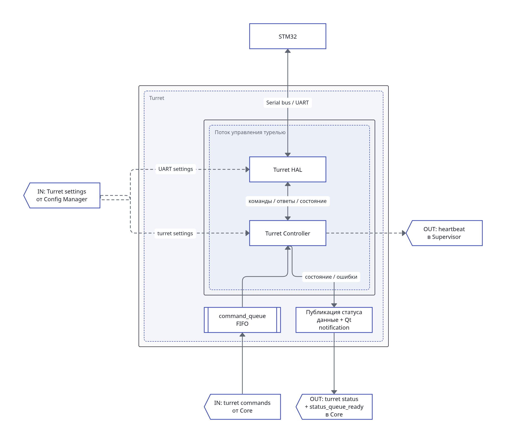
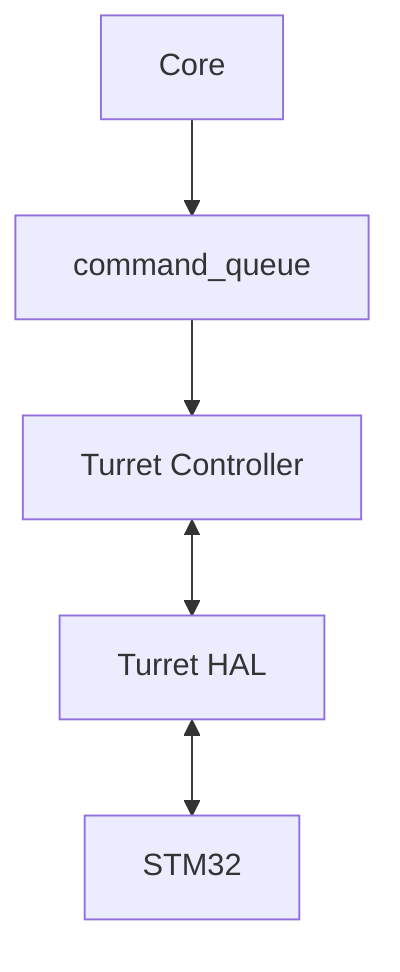
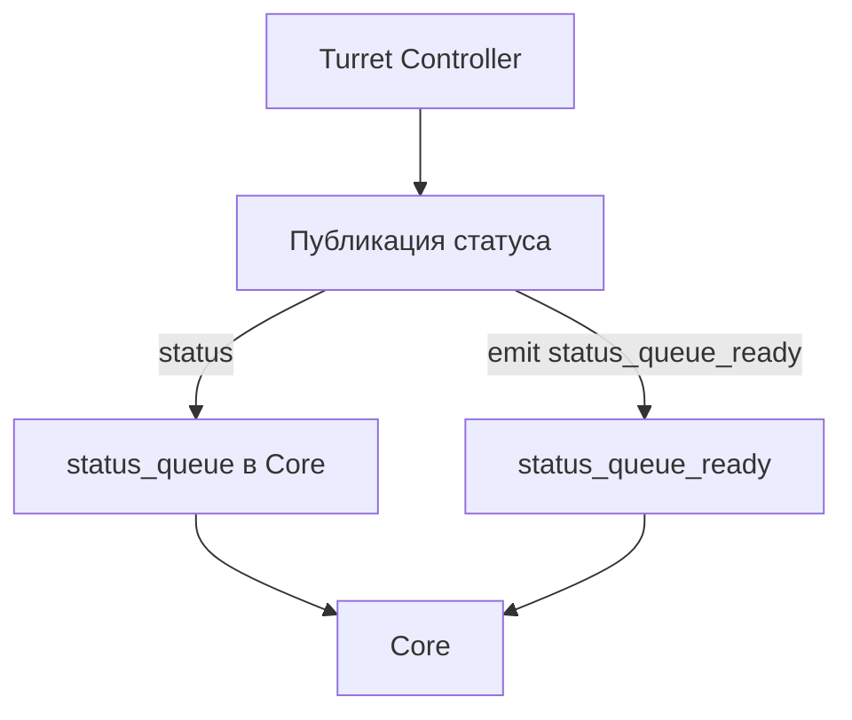
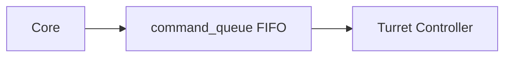
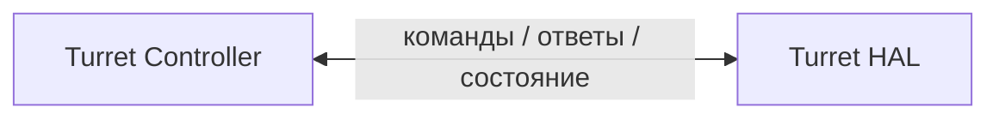
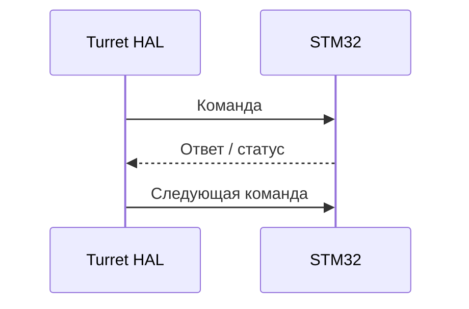
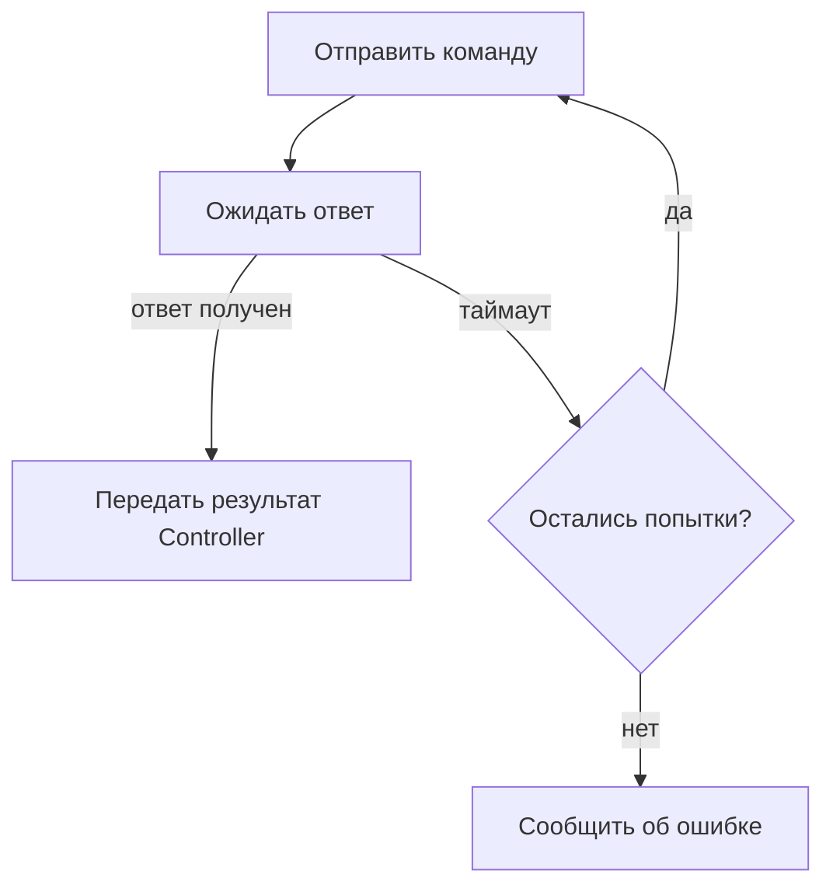
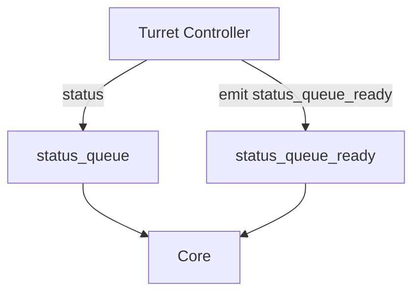
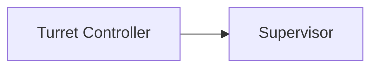

# Управление турелью (turret)

Модуль `Turret` отвечает за управление физической турелью: наведение по двум осям, калибровку, компенсацию люфта и обмен с контроллером STM32.



## Общая структура

Модуль состоит из двух основных уровней:

- `Turret Controller` — высокоуровневая логика управления;
- `Turret HAL` — низкоуровневое взаимодействие со STM32.

Оба компонента работают в одном отдельном потоке управления турелью.

Основной путь команды выглядит так:



Обратное состояние передаётся через отдельный канал:



## Поток управления турелью

Для `Turret` используется один отдельный рабочий поток.

В этом потоке выполняются:

- чтение `command_queue`;
- логика наведения;
- PI-регулятор;
- компенсация люфта;
- калибровка;
- вызовы `Turret HAL`;
- обмен со STM32;
- публикация состояния;
- heartbeat для Supervisor.

`Turret HAL` не имеет отдельного потока.

Такое разделение позволяет выполнять операции с оборудованием независимо от главного потока UI/Core и от Vision Pipeline.

## command_queue

Команды Core → Turret передаются через `command_queue`.

Очередь находится на стороне Turret и работает как обычная FIFO-очередь:



В отличие от потоковых данных Vision, команды управления нельзя автоматически заменять более новыми. Они должны обрабатываться в определённом порядке.

Конкретный набор команд и их формат будет определён отдельно при проработке поведения Turret и протокола STM32.

На этапе архитектурного аудита отдельно нужно проверить приоритет аварийной команды `STOP`: она не должна надолго задерживаться за обычными командами, если очередь уже заполнена.

## Turret Controller

`Turret Controller` реализует высокоуровневую логику управления турелью.

Он получает команду от Core и решает, какие действия нужно выполнить через `Turret HAL`.

### Основные функции

#### Наведение

Предусмотрены два основных режима.

**Относительное смещение**

Controller получает приращение по каждой оси:

- `ΔX`;
- `ΔY`.

После этого он перемещает турель на заданное количество шагов или угловых единиц.

**Сопровождение цели**

Controller получает ошибку рассогласования между положением цели и прицельной точкой.

Для каждой оси используется PI-регулятор:

- пропорциональная составляющая определяет реакцию на текущую ошибку;
- интегральная составляющая компенсирует постоянное небольшое отклонение.

Регуляторы для X и Y работают независимо.

Результатом работы регулятора становится команда движения, которая передаётся через `Turret HAL`.

#### Компенсация люфта

При смене направления движения Controller может добавлять дополнительное смещение, компенсирующее механический люфт.

Компенсация задаётся отдельно для:

- оси X;
- оси Y.

Это необходимо, потому что величина люфта механики по двум осям может различаться.

#### Калибровка

Калибровка включает как минимум:

- пристрелку — определение смещения прицела относительно механической оси;
- определение компенсации люфта для каждой оси.

Конкретная последовательность действий пользователя и алгоритм калибровки должны быть описаны отдельно в документации процедуры калибровки.

## Turret HAL

`Turret HAL` (`Hardware Abstraction Layer`) скрывает от Controller детали последовательного протокола и конкретной реализации связи со STM32.

Controller работает с высокоуровневыми операциями, а HAL преобразует их в команды протокола.

Основные обязанности HAL:

- открыть и настроить последовательный порт;
- сформировать пакет команды;
- передать пакет STM32;
- принять ответ;
- проверить корректность ответа;
- обработать таймаут;
- при необходимости повторить передачу;
- сообщить Controller об ошибке.

Взаимодействие Controller ↔ HAL является внутренним вызовом внутри одного потока:



## Связь со STM32

STM32 непосредственно управляет исполнительными механизмами турели.

Связь выполняется через последовательный интерфейс UART.

Канал является **двунаправленным полудуплексным**: данные передаются в обе стороны, но не одновременно.

Типичный обмен:



HAL не должен отправлять следующую команду в момент, когда ожидается ответ на предыдущую, если это нарушает правила выбранного протокола.

Подробный формат пакетов и набор кодов команд вынесены в отдельный документ:

[Протокол контроллера](../../architecture/serial-protocol.md)

## Таймауты и повторные попытки

Если STM32 не отвечает за заданное время, `Turret HAL` считает попытку неуспешной.

Далее HAL может повторить команду до `retry_count` раз.



Конкретные значения `timeout_ms` и `retry_count` хранятся в конфигурации и должны подбираться с учётом реальной линии связи и времени реакции STM32.

## Публикация состояния

`Turret Controller` публикует состояние, которое должно быть доступно Core и UI.

К нему могут относиться:

- текущее положение;
- режим работы;
- готовность;
- состояние калибровки;
- ошибки связи;
- другие ошибки Turret.

На стороне Core находится `status_queue`.

После подготовки нового состояния Turret:

1. записывает данные в `status_queue`;
2. отправляет Qt-сигнал `status_queue_ready`;
3. Core получает уведомление и читает очередь.



На текущем этапе `status_queue` рассматривается как FIFO.

Во время архитектурного аудита отдельно нужно проверить, стоит ли разделить:

- текущее состояние, где важно прежде всего самое новое значение;
- события и ошибки, которые нельзя терять.

## Обработка ошибок

Если связь со STM32 окончательно потеряна после всех повторных попыток:

1. HAL сообщает об ошибке Controller;
2. Controller переводит Turret в безопасное состояние;
3. информация об ошибке публикуется для Core;
4. Core передаёт её UI.

Безопасное состояние как минимум предполагает прекращение движения приводов.

Точное поведение при разных классах ошибок будет уточнено на этапе архитектурного аудита.

## Heartbeat

`Turret Controller` отправляет heartbeat в `Supervisor`.



Если heartbeat не поступает дольше допустимого времени, Supervisor сообщает Core о проблеме.

На первом этапе Supervisor только обнаруживает сбой и уведомляет систему. Автоматический перезапуск потока Turret пока не является обязательным.

## Конфигурация

Настройки Turret поступают от `Config Manager` и применяются соответствующими компонентами.

### Последовательный интерфейс

- `port` — имя последовательного порта;
- `baudrate` — скорость UART;
- `timeout_ms` — таймаут ответа STM32;
- `retry_count` — количество повторных попыток.

### PI-регулятор

Для каждой оси задаются свои коэффициенты:

- `pid_kp_x`;
- `pid_ki_x`;
- `pid_kp_y`;
- `pid_ki_y`.

### Компенсация люфта

- `backlash.x`;
- `backlash.y`.

Подробная структура конфигурации описана отдельно:

[Конфигурация](../../architecture/configuration.md)

## Эмуляция STM32

Для разработки и тестирования без физической турели предусмотрен режим эмуляции STM32.

Эмулятор должен предоставлять интерфейс, совместимый с реальным низкоуровневым взаимодействием, чтобы `Turret Controller` не зависел от того, подключено физическое устройство или используется симуляция.

Эмулятор может:

- принимать команды;
- возвращать фиктивные ответы;
- имитировать задержку выполнения;
- имитировать движение приводов;
- добавлять искусственный шум или ошибки для тестирования.

Режим включается параметром конфигурации:

```text
emulate_stm32: true
```

Это позволяет проверять:

- логику наведения;
- PI-регулятор;
- компенсацию люфта;
- обработку команд;
- обработку ошибок;

без подключения реальной STM32.

## Границы ответственности

`Turret Controller` не должен:

- формировать байтовые пакеты UART;
- напрямую работать с последовательным портом;
- выполнять обработку изображения;
- выбирать или сопровождать объект.

`Turret HAL` не должен:

- решать, куда нужно наводить турель;
- выполнять PI-регулирование;
- выбирать режим наведения;
- содержать логику UI.

Такое разделение позволяет менять протокол STM32 или способ управления приводами без необходимости переписывать высокоуровневую логику Turret.
