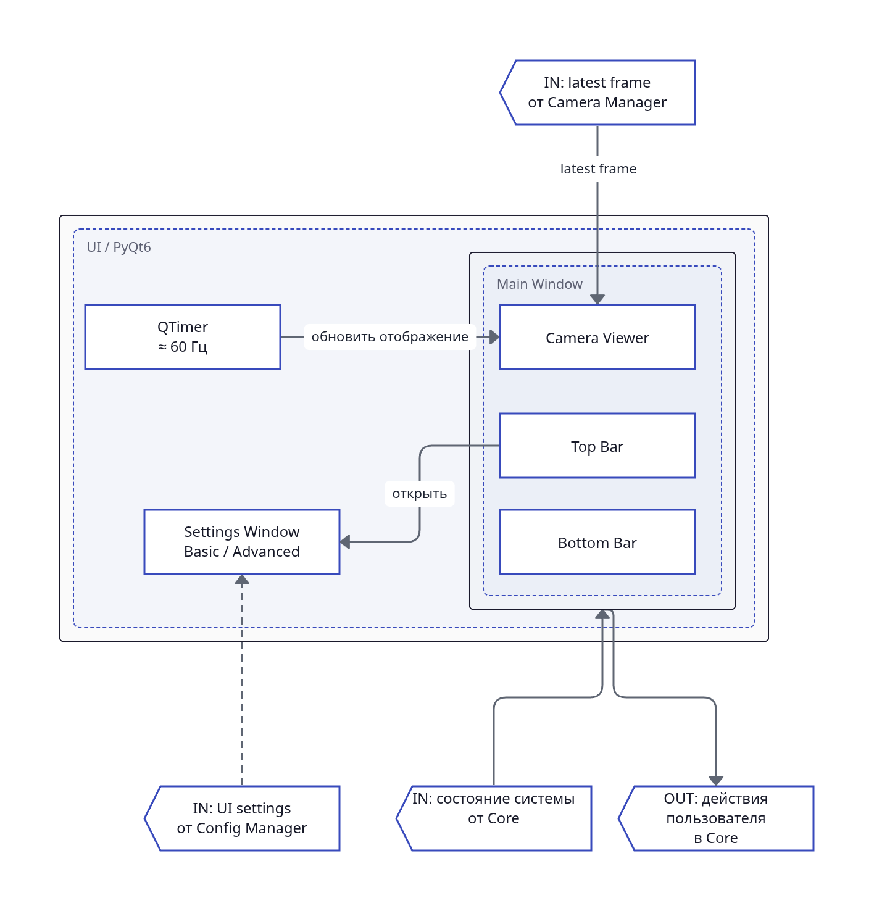
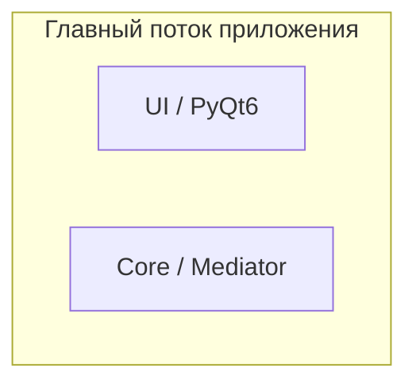
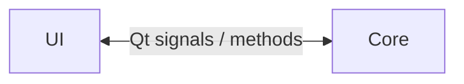
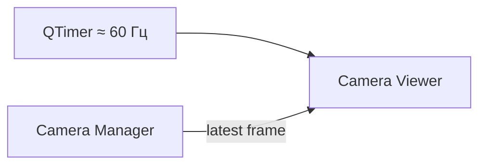
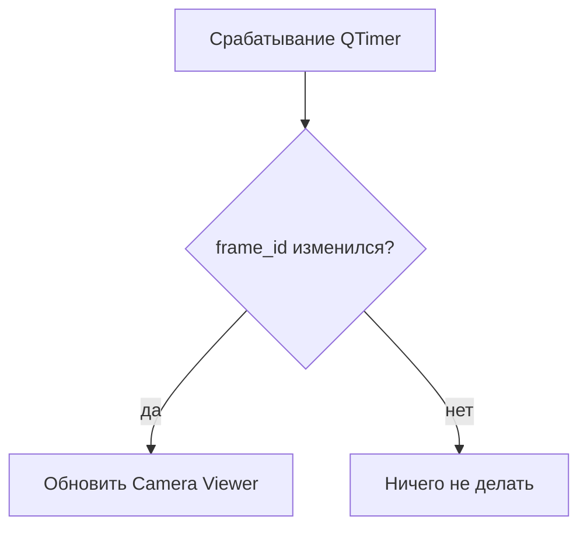
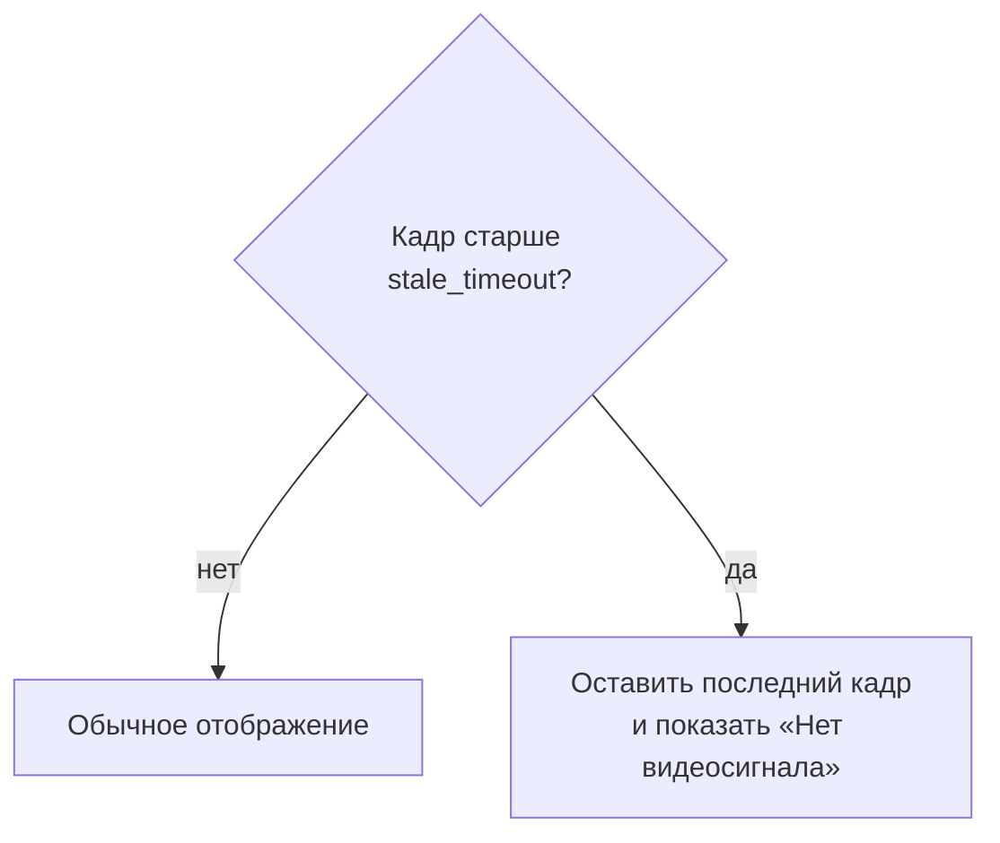
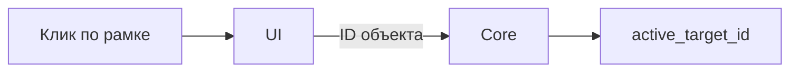
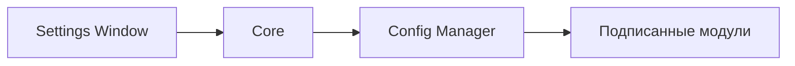
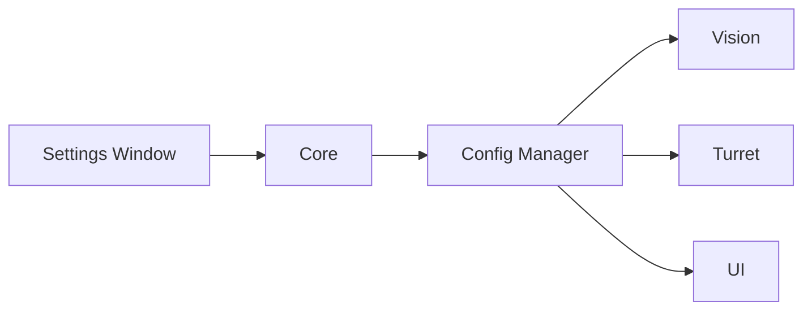

# Графический интерфейс (gui)

Модуль `UI` предоставляет оператору доступ к видеопотокам, выбору цели, управлению турелью, настройкам и состоянию системы.

Интерфейс написан на `PyQt6` и работает в главном потоке приложения.



## Общая структура

UI состоит из:

- `Main Window` — основного рабочего окна;
- `Camera Viewer` — области отображения видео;
- `Top Bar` — верхней панели управления;
- `Bottom Bar` — нижней панели состояния и быстрых действий;
- `Settings Window` — окна настроек.

Core работает в том же главном потоке, но является отдельным логическим модулем.



UI не выполняет детекцию, трекинг или расчёт дальности. Он только отображает данные, которые уже подготовлены другими модулями, и передаёт действия пользователя в Core.

## Взаимодействие с Core

Поскольку UI и Core находятся в одном потоке, отдельные `ui_command_queue` и `ui_status_queue` не используются.

Для взаимодействия применяются:

- обычные вызовы методов;
- Qt-сигналы.



Примеры действий UI → Core:

- выбор цели;
- снятие выбора;
- изменение режима работы;
- команды Turret;
- запуск калибровки;
- экстренная остановка;
- изменение настроек.

Примеры данных Core → UI:

- актуальный `list[DetectedObject]`;
- `active_target_id`;
- состояние Turret;
- ошибки и предупреждения;
- состояние модулей.

Видеокадры через Core не передаются.

## Получение видеокадров

`Camera Viewer` получает актуальный кадр напрямую из `Camera Manager`.

`Camera Manager` хранит для каждой камеры:

- `latest_frame`;
- `frame_id`;
- `timestamp`;
- `state`.

UI не получает отдельный Qt-сигнал на каждый новый кадр. Вместо этого используется `QTimer` с частотой около 60 Гц.



При каждом срабатывании таймера UI проверяет состояние выбранной камеры.

## frame_id

UI хранит номер последнего отображённого кадра:

```text
last_displayed_frame_id
```

Кадр перерисовывается только тогда, когда `frame_id` в `Camera Manager` изменился.

Например, при камере 20 FPS и UI-таймере 60 Гц таймер срабатывает чаще, чем появляются новые кадры. Это нормально: повторное срабатывание не вызывает повторную отрисовку того же изображения.



Такой подход не создаёт очередь старых кадров. UI всегда работает с самым свежим изображением, сохранённым в `Camera Manager`.

## Контроль потери видеосигнала

Для каждой камеры известно время получения последнего кадра (`timestamp`).

UI сравнивает его с текущим временем. Если новый кадр не поступал дольше `stale_timeout`, видеопоток считается устаревшим.

При превышении `stale_timeout`:

- последний полученный кадр остаётся на экране;
- поверх него отображается сообщение **«Нет видеосигнала»**.



Само значение `stale_timeout` хранится в конфигурации и должно быть уточнено после тестов на реальных камерах.

Обнаружение проблемы соединения и попытки переподключения выполняет `CameraController`, а UI только показывает пользователю текущее состояние.

## Main Window

`Main Window` является основной рабочей областью оператора.

В нём находятся:

- `Camera Viewer`;
- `Top Bar`;
- `Bottom Bar`.

## Camera Viewer

`Camera Viewer` отображает видеопоток выбранной камеры.

Поверх кадра могут отображаться рамки объектов из актуального `list[DetectedObject]`, полученного от Core.

Для объекта могут показываться:

- ID;
- рамка;
- скорость, если Tracker её вычисляет;
- дальность для активной цели, если она определена;
- дополнительное состояние, необходимое оператору.

Активная цель должна визуально отличаться от остальных объектов.

### Выбор цели

В ручном режиме оператор выбирает цель кликом по её рамке.



UI не хранит выбранную цель как основной источник состояния. Владельцем `active_target_id` является Core.

Клик по пустой области может использоваться для снятия текущего выбора.

## Режимы выбора цели

В исходном описании предусмотрены три режима:

- **Ручная** — цель выбирает оператор;
- **Ближайшая** — автоматически выбирается ближайший подходящий объект;
- **Самая быстрая** — автоматически выбирается объект с максимальной скоростью.

Ручной режим рассматривается как режим по умолчанию.

Точная логика автоматического выбора цели и место её реализации будут отдельно проверены на этапе архитектурного аудита. UI должен предоставлять переключение режима, но не обязательно самостоятельно выполнять алгоритм выбора объекта.

## Top Bar

Верхняя панель содержит глобальные действия.

В текущем описании предусмотрены:

- меню `Файл`;
- меню `Вид`;
- кнопка `Настройки`;
- кнопка `Калибровка`;
- кнопка `Экстренная остановка`;
- индикатор системных ошибок.

### Файл

Меню может содержать:

- загрузку конфигурации;
- сохранение конфигурации;
- выход из приложения.

### Вид

Меню используется для настроек отображения, например:

- переключения камеры;
- включения и отключения рамок объектов.

### Настройки

Открывает `Settings Window`.

### Калибровка

Передаёт в Core запрос на запуск процедуры калибровки Turret.

### Экстренная остановка

Отправляет в Core команду аварийной остановки.

UI не должен напрямую обращаться к STM32 или `Turret HAL`.

Поведение и приоритет команды `STOP` будут отдельно проверены при архитектурном аудите Turret.

## Bottom Bar

Нижняя панель используется для быстрого управления и отображения основного состояния системы.

Здесь могут находиться:

### Режим сопровождения

- `Ручная`;
- `Ближайшая`;
- `Самая быстрая`.

### Состояние оборудования

- подключение каждой камеры;
- состояние STM32;
- состояние Turret.

### Информация о цели

- ID выбранного объекта;
- дальность;
- скорость;
- другой краткий статус.

### Состояние Vision

Например:

- количество обнаруженных объектов;
- FPS обработки.

Точный состав элементов может меняться при реализации UI, не затрагивая архитектуру взаимодействия модулей.

## Settings Window

`Settings Window` используется для изменения конфигурации системы.

Пользователь изменяет параметры в UI, после чего новое значение передаётся в Core, а затем в `Config Manager`.



UI не должен напрямую изменять внутреннее состояние рабочих потоков.

## Базовые настройки

В базовой части могут находиться:

- выбор последовательного порта STM32;
- включение или отключение обработки для каждой камеры;
- выбор Detector для каждой камеры;
- выбор Tracker для каждой камеры;
- выбор источника дальности:
  - `stereo`;
  - `manual`;
- ручное значение дальности при `distance_source = "manual"`.

В будущем список источников дальности может быть расширен, например вариантом `lidar`.

## Расширенные настройки

К расширенным настройкам относятся параметры, которые обычно не требуется менять во время обычной работы:

- коэффициенты PI-регулятора;
- компенсация люфта;
- таймауты и повторные попытки STM32;
- параметры видеопотока;
- RTP;
- параметры алгоритмов Vision.

Точное место хранения параметров конкретных Detector и Tracker пока не фиксируется окончательно: в старом описании архитектуры по этому вопросу есть противоречие. Оно будет устранено при переработке `Config Manager`.

Подробная структура настроек описана отдельно:

[Конфигурация](../../architecture/configuration.md)

## Динамическое применение настроек

Изменение настроек проходит через Core:



Конкретный модуль получает только относящиеся к нему изменения.

Некоторые параметры можно применить сразу, но для настроек, требующих пересоздания ресурса, может понадобиться локальный перезапуск соответствующего компонента. Точная политика будет определена при архитектурном аудите конфигурации.

## Ошибки и уведомления

UI отображает пользователю ошибки и предупреждения, которые получает от Core.

Примеры:

- потеря камеры;
- устаревший видеопоток;
- ошибка Vision;
- потеря связи со STM32;
- ошибка Turret;
- предупреждение Supervisor.

В исходном описании для этого предусмотрены:

- краткое всплывающее уведомление;
- индикатор системных ошибок;
- возможность открыть подробное описание.

Логирование выполняется общим механизмом приложения. UI не должен самостоятельно записывать ошибки непосредственно в лог-файл.

## Производительность UI

UI работает в главном потоке, поэтому в нём нельзя выполнять тяжёлые или блокирующие операции.

В частности, UI не должен:

- декодировать сетевой видеопоток;
- выполнять Detector;
- выполнять Tracker;
- рассчитывать стереодальность;
- ожидать ответ STM32;
- блокироваться на межпотоковых очередях.

Его основная работа:

- обработка событий пользователя;
- получение уже готового состояния;
- отображение актуального кадра;
- рисование рамок и служебной информации;
- обновление виджетов.

Использование `QTimer` для просмотра `latest_frame` позволяет UI не зависеть от частоты камер и не создавать очередь событий для каждого полученного кадра.

## Завершение приложения

Закрытие главного окна инициирует штатное завершение всей системы через Core.

UI не должен самостоятельно завершать рабочие потоки или закрывать аппаратные интерфейсы.

После начала завершения интерфейс должен предотвращать отправку новых обычных команд, пока Core координирует остановку остальных компонентов.

Точный порядок штатного завершения описывается на уровне Core и будет дополнительно проверен при архитектурном аудите.

## Границы ответственности

UI отвечает за:

- отображение;
- ввод пользователя;
- представление состояния системы;
- изменение настроек через Core.

UI **не отвечает** за:

- хранение `active_target_id` как источника истины;
- обработку видео;
- обнаружение объектов;
- сопровождение объектов;
- расчёт дальности;
- управление последовательным портом;
- работу протокола STM32;
- принятие низкоуровневых решений по управлению Turret.

Такое разделение позволяет изменять внешний вид интерфейса без изменения алгоритмов Vision и Turret.
