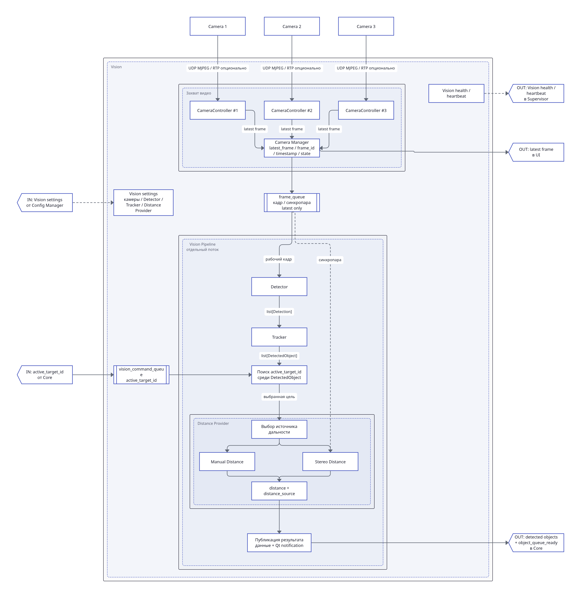
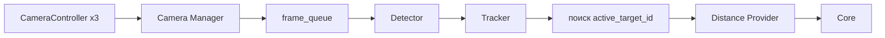

# Зрение и детектирование (vision)

Модуль `Vision` отвечает за получение видеопотоков с трёх камер, обнаружение и сопровождение объектов, а также определение дальности до выбранной цели.



## Общая структура

В модуле используются четыре рабочих потока:

- три отдельных потока `CameraController` — по одному на каждую камеру;
- один поток `Vision Pipeline` — для Detector, Tracker и Distance Provider.

`Camera Manager` собственного потока не имеет. Это общий потокобезопасный объект, через который контроллеры камер передают актуальные кадры, а Vision Pipeline и UI получают нужные данные.

Основной путь обработки выглядит так:



## Камеры

Используются три Raspberry Pi с камерами, подключённые по Ethernet к общей локальной сети:

- две камеры образуют стереопару и используются для точного прицеливания и определения дальности;
- третья камера имеет больший угол обзора и используется для общего наблюдения.

Каждая камера обслуживается своим экземпляром `CameraController`.

## CameraController

В системе создаются три экземпляра одного класса:

- `CameraController #1`;
- `CameraController #2`;
- `CameraController #3`.

Каждый экземпляр работает в отдельном потоке и отвечает только за свою камеру.

Основные задачи `CameraController`:

- подключение к указанному IP-адресу и порту;
- получение MJPEG-видеопотока по UDP;
- опциональное использование RTP;
- декодирование изображения;
- преобразование кадра в `NumPy Array`;
- обновление актуального кадра в `Camera Manager`;
- отслеживание состояния соединения;
- автоматическое переподключение при потере видеопотока.

Для получения видео используются OpenCV и GStreamer bindings. Отдельный бинарник FFmpeg для этого не требуется.

Отдельные потоки нужны для того, чтобы проблема одной камеры не блокировала две остальные. Например, если одна камера перестала отвечать и её контроллер выполняет переподключение, другие `CameraController` продолжают принимать кадры.

## Camera Manager

`Camera Manager` объединяет доступ к трём камерам. Он не выполняется в отдельном потоке и не занимается тяжёлой обработкой изображения.

Для каждой камеры он хранит:

- `latest_frame` — последний полученный кадр;
- `frame_id` — номер кадра;
- `timestamp` — время его получения;
- `state` — текущее состояние видеопотока.

Новый кадр заменяет предыдущий. Старые кадры специально не накапливаются.

Это важно для системы наведения: если обработка временно отстала, после освобождения ей нужен самый свежий кадр, а не очередь устаревших изображений.

### Передача кадров в UI

UI получает из `Camera Manager` только актуальный кадр. Подробная логика обновления изображения описана в документации модуля GUI.

### Стереопара

Когда используется стереоопределение дальности, `Camera Manager` формирует синхронизированную пару кадров левой и правой камеры.

Поскольку обе камеры принимаются независимыми `CameraController`, кадры сопоставляются по времени получения (`timestamp`). Для обработки выбираются наиболее близкие по времени кадры.

Если стереорежим не используется, синхропара для расчёта дальности не требуется.

## frame_queue

Между `Camera Manager` и `Vision Pipeline` используется `frame_queue`.

Очередь имеет семантику **latest only**: в ней должен находиться только самый свежий элемент, необходимый для следующего цикла обработки.

В зависимости от выбранного источника дальности элементом может быть:

- один рабочий кадр;
- синхронизированная пара кадров.

Если новый кадр появился до того, как предыдущий был обработан, устаревший кадр можно заменить новым. Это предотвращает накопление задержки.

## Vision Pipeline

Detector, Tracker и Distance Provider выполняются последовательно в одном отдельном потоке `Vision Pipeline`.

Общий цикл обработки:

1. Получить самый свежий кадр или синхропару из `frame_queue`.
2. Передать рабочий кадр в Detector.
3. Получить `list[Detection]`.
4. Передать его в Tracker.
5. Получить `list[DetectedObject]`.
6. Проверить, выбран ли в Core активный объект (`active_target_id`).
7. Если активная цель существует в текущем списке объектов — определить дальность до неё через `Distance Provider`.
8. Опубликовать актуальный список объектов для Core.
9. Уведомить Core Qt-сигналом `object_queue_ready`.

Detector, Tracker и Distance Provider не имеют собственных потоков.

## Detector

Detector обнаруживает объекты только в текущем кадре. Он не связывает обнаружения между разными кадрами.

Результат работы — список `Detection`.

Каждый `Detection` содержит:

- координаты рамки `(x, y, w, h)`;
- рассчитанные признаки объекта;
- опциональную оценку уверенности (`confidence`).

Detector реализуется как абстрактный интерфейс, поэтому конкретный алгоритм можно заменить без изменения Tracker и остальных частей Vision.

### Подход 1. Скользящее окно

Окно фиксированного размера перемещается по изображению с заданным шагом. Для каждой позиции вычисляются признаки, после чего классификатор определяет, находится ли объект внутри окна.

Подход хорошо работает, когда размеры искомого объекта близки к размеру окна. Для объектов сильно разного размера требуется использовать несколько масштабов.

### Подход 2. Поиск ROI

Сначала быстрый алгоритм выделяет области-кандидаты (`ROI`), например по границам, контрасту или изменению яркости. После этого классификатор проверяет только найденные области.

Этот вариант уменьшает число проверяемых участков кадра и лучше подходит для небольших контрастных объектов. В текущем описании проекта он рассматривается как основной вариант.

### Признаки

В старом описании архитектуры для классификатора был предложен набор геометрических, яркостных, контрастных, гистограммных, цветовых, текстурных, градиентных и пространственных признаков.

Точная размерность этого вектора и окончательный набор признаков будут отдельно проверены на этапе архитектурного аудита. В текущем тексте есть несогласованность между перечисленными признаками и заявленным общим количеством, поэтому здесь число признаков пока не фиксируется как окончательное.

## Tracker

Tracker получает `list[Detection]` из последовательных кадров и связывает наблюдения с конкретными объектами во времени.

Tracker также задаётся через абстрактный интерфейс. Возможные реализации включают, например, алгоритмы на основе:

- венгерского алгоритма;
- фильтра Калмана;
- SORT.

Результат — `list[DetectedObject]`.

`DetectedObject` может содержать:

- уникальный ID;
- текущую рамку;
- историю последних положений;
- скорость;
- оценку траектории;
- признаки последнего обнаружения, если они нужны выбранной реализации Tracker.

Именно ID позволяет Core хранить `active_target_id` и выбирать один конкретный объект для дальнейшего наведения.

## Выбор активной цели

Выбранная цель хранится не внутри Vision, а в Core как `active_target_id`.

Core передаёт новое значение в Vision через `vision_command_queue`.

Перед расчётом дальности Vision проверяет, присутствует ли объект с таким ID в текущем `list[DetectedObject]`.

Если цель не выбрана или объект временно потерян, Distance Provider для этого кадра не выполняет расчёт дальности.

## Distance Provider

`Distance Provider` отвечает за получение дальности до активной цели независимо от конкретного способа измерения.

Остальная часть Vision использует единый интерфейс и получает:

- `distance` — дальность;
- `distance_source` — источник значения.

На текущем этапе предусмотрены два источника:

- `stereo`;
- `manual`.

В будущем можно добавить другие реализации, например лидар, не меняя Detector, Tracker или Core.

### Stereo Distance

При `distance_source = "stereo"` Distance Provider использует синхронизированную пару кадров.

Detector и Tracker работают по одному рабочему кадру пары. После получения ID активной цели Stereo Distance использует её рамку и второй кадр стереопары для вычисления расстояния.

Дальность рассчитывается только для выбранного объекта, а не для всех обнаруженных объектов.

Расчёт выполняется на каждом обработанном кадре, пока активная цель существует.

### Manual Distance

При `distance_source = "manual"` стереорасчёт не выполняется.

Distance Provider подставляет постоянное значение дальности, которое пользователь задал в настройках.

Такой режим использует тот же выходной интерфейс, что и стереозрение:

```text
distance
distance_source = "manual"
```

Поэтому Core и Turret не должны отдельно обрабатывать ручной и стереорежимы.

## Обмен с Core

### Vision → Core

После обработки кадра Vision публикует актуальный `list[DetectedObject]`.

Сама `object_queue` находится на стороне Core и имеет семантику **latest only**. После записи нового результата Vision посылает Qt-сигнал `object_queue_ready`, чтобы Core обработал данные без периодического polling.

### Core → Vision

Для управляющих данных используется `vision_command_queue`, которая находится в Vision.

На текущем этапе через неё передаётся прежде всего:

- выбор `active_target_id`;
- снятие выбранной цели.

Vision проверяет управляющие сообщения перед обработкой очередного кадра.

## Состояние и heartbeat

Vision передаёт в Supervisor общее состояние (`Vision health / heartbeat`).

Heartbeat нужен для обнаружения ситуации, когда Vision или его рабочие части перестали обновляться.

На диаграмме используется один общий интерфейс состояния Vision, чтобы не перегружать схему. Внутренняя детализация heartbeat для отдельных `CameraController` и Vision Pipeline может быть определена при реализации Supervisor.

## Ошибки видеопотока

При потере соединения соответствующий `CameraController` пытается переподключиться автоматически.

`Camera Manager` продолжает хранить:

- последний полученный кадр;
- время его получения;
- состояние камеры.

Это позволяет UI определить, что кадр устарел, и показать пользователю сообщение о потере видеосигнала, не накапливая старые изображения.

## Конфигурация

Vision получает изменения настроек от `Config Manager`.

К настройкам Vision относятся как минимум:

- параметры подключения камер;
- включение RTP;
- выбор Detector;
- выбор Tracker;
- настройки Distance Provider;
- ручная дальность;
- параметры стереорежима;
- параметры контроля видеопотока.

Подробная структура конфигурации вынесена в отдельный документ:

[Конфигурация](../../architecture/configuration.md)

Точное место хранения внутренних параметров конкретных реализаций Detector и Tracker будет согласовано отдельно: старое описание архитектуры содержит по этому вопросу противоречивые требования.

## Режим симуляции

Для разработки без реальных камер `CameraController` может использовать другой источник кадров:

- видеофайл;
- последовательность изображений;
- синтетический генератор;
- виртуальную OBS-камеру.

Для остальных компонентов Vision источник должен выглядеть так же, как реальная камера: на выходе они получают актуальные кадры через тот же интерфейс.

Это позволяет тестировать Detector, Tracker и остальную систему без изменения их кода.
